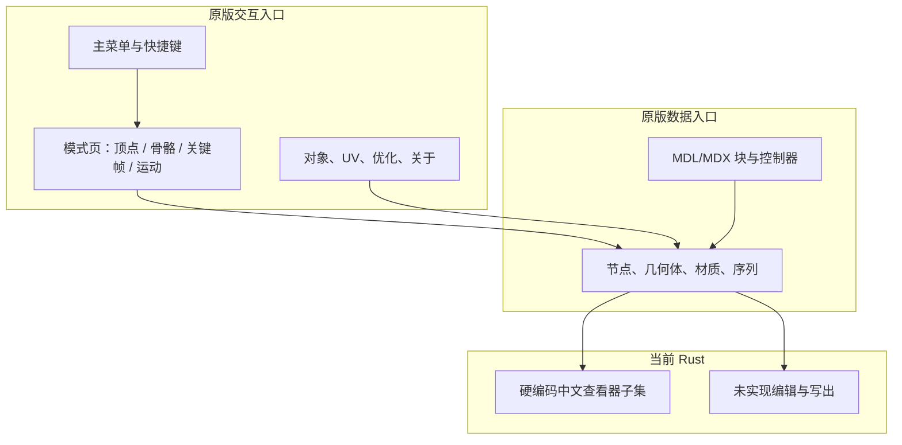

# 原版功能与格式矩阵

## 元信息

| 项目 | 值 |
| --- | --- |
| 作者 | 项目维护者与协作者 |
| 维护人 | mdlvis-rs 维护者 |
| 状态 | 已完成 |
| 创建日期 | 2026-08-13 |
| 最后更新 | 2026-08-14 |

## 概述

本文面向实现、评审和验证人员，冻结原版 MdlVis 的窗口、菜单、命令、快捷键、对象类型和 MDL/MDX 块覆盖。它把“完整复刻”拆成可逐项验收的证据表，并标注当前 Rust 子集的真实覆盖。

## 文档定位

- 本文回答：原版有哪些可观察入口、每项对应哪段源码、Rust 当前是查看器子集还是尚未实现。
- 本文不回答：阶段排期、任务领取者和临时阈值；这些内容进入 `docs/plans/01-完整复刻推进计划.md`。
- 菜单原文为俄文 Windows-1251。中文名是意译，控件名和 `OnClick` 保持原标识。
- 源码与本文冲突时，以 `delphi/` 和可重复运行结果为准，并更新本文。

## 真相源

| 来源 | 负责内容 |
| --- | --- |
| `delphi/frmmain.dfm`、`delphi/frmmain.pas` | 主窗口、主菜单、弹出菜单、工具栏、快捷键和模式页。 |
| `delphi/mdlvis.dpr` | 启动时创建的窗体清单。 |
| `delphi/un_obj.pas/.dfm`、`delphi/unTex.pas/.dfm`、`delphi/un_optimize.pas/.dfm`、`delphi/addFrame.pas/.dfm`、`delphi/unAbout.pas/.dfm`、`delphi/un_warn.pas/.dfm` | 辅助窗口与专用编辑器。 |
| `delphi/objedut.pas` | 撤销类型常量和破坏性编辑分类。 |
| `delphi/mdlwork.pas` | 对象模型、MDL/MDX 读写和四CC。 |
| `delphi/mdlDraw.pas` | 动画求值、节点类型识别和绘制模式。 |
| `src/parser/`、`src/ui.rs`、`src/model/` | Rust 当前读取与查看器入口。 |

## 文档边界

- 本文解释原版功能入口、格式块和对象覆盖，以及 Rust 当前状态。
- 本文不把菜单可见性或启用状态当成“功能不存在”；隐藏菜单在对应编辑模式下仍可出现。
- 本文不把 WoW M2/WMO 导入或 MDX 900+ 列为必达项；它们单独标记为原版扩展或明确不支持。
- 浮点阈值以采集协议 v1 为准；本文不改写那些数字。

## 关键图示

## 目标状态口径

| 目标状态 | 含义 |
| --- | --- |
| 查看器 | 读取并显示，不要求编辑命令。 |
| 编辑器 | 必须经命令层修改模型，并具备撤销、重做、保存和重开。 |
| 工具 | 优化、检查、导入转换等非核心编辑入口。 |
| 扩展 | 原版存在，但不进入 Warcraft III 完整复刻必达项，除非后续计划显式纳入。 |
| 有意不兼容 | 已有证据表明不应复刻，或属于原版缺陷。 |

未单独标注的菜单项，默认按其所在功能域进入后续里程碑：文件/查看进入 M3，对象/动画编辑进入 M4，几何/UV/优化进入 M5。

## 窗口与面板

| 窗口/面板 | 原版标识 | 源码位置 | 作用 | 目标状态 | Rust 当前 |
| --- | --- | --- | --- | --- | --- |
| 主窗口 | `Tfrm1` / `frm1` | `mdlvis.dpr:32`；`frmmain.pas` | 打开模型、3D 视口、模式切换和主命令 | 查看器 + 编辑器 | 有硬编码中文查看窗口，无语言切换，无编辑模式 |
| 3D 工作区 | `GLWorkArea` | `frmmain.pas:13` | OpenGL 视口、选择和变换手势 | 查看器 + 编辑器 | wgpu 视口，仅观察 |
| 对象窗口 | `Tfrm_obj` / `frm_obj` | `mdlvis.dpr:36`；`un_obj.dfm` | 序列、几何体和骨架对象列表；可树状显示 | 编辑器 | 无 |
| UV 编辑器 | `TfrmTex` / `frmTex` | `mdlvis.dpr:33`；`unTex.dfm` | 纹理坐标选择、移动、旋转、缩放、镜像和投影 | 编辑器 | 仅有纹理列表面板 |
| 优化器 | `Tfrm_optimize` | `mdlvis.dpr:37`；`un_optimize.dfm` | 勾选并执行优化动作 | 工具 | 无 |
| 插入空帧 | `TfrmAdd` / `frmAdd` | `mdlvis.dpr:34`；`addFrame.dfm` | 在时间轴插入空白关键帧 | 编辑器 | 无 |
| 关于 | `TfrmAbout` | `mdlvis.dpr:35` | 程序信息 | 查看器 | 无 |
| 警告 | `Tfrm_warn` | `mdlvis.dpr:38` | 通用警告对话框 | 查看器 | 无独立窗体 |
| 模式页 | `tc_mode` | `frmmain.dfm:4315-4330` | 骨骼 / 关键帧 / 运动 三个动画子模式 | 编辑器 | 无 |
| 动画面板 | `pn_anim`、`pb_anim`、`cb_animlist` | `frmmain.pas:99-128` | 序列选择、帧条、播放、循环、FPS、创建/删除序列 | 查看器 + 编辑器 | 有序列选择、播放和帧滑块 |
| 骨骼属性 | `pn_boneedit`、`pn_boneprop`、`pn_atchprop` | `frmmain.pas:129-269` | 骨骼/附着点坐标、公告牌、路径和父子绑定 | 编辑器 | 无 |
| 控制器属性 | `pn_contrprops`、`pn_spline` | `frmmain.pas:300-319` | 插值类型、切线 T/C/Bias、删除控制器 | 编辑器 | 无 |
| 几何体列表 | `clb_geolist`、`PM_geosets` | `frmmain.pas:93` | 显示/隐藏几何体 | 查看器 | 有几何体开关 |
| 透视按钮 | `pn_view` | `frmmain.dfm:4333-4342` | 打开六视图弹出菜单 | 查看器 | 有重置相机，无六视图菜单 |

## 主菜单与命令

DFM 未设置 `ShortCut`。下列快捷键来自 `Tfrm1.FormKeyDown`（`frmmain.pas:2591-2751`）。

| 菜单路径 | 控件名 | 快捷键 | OnClick | 源码位置 | 行为摘要 | 功能域 | 目标状态 | Rust 当前 |
| --- | --- | --- | --- | --- | --- | --- | --- | --- |
| 文件 / 打开 | `N2` | Ctrl+O | `N2Click` | `frmmain.dfm:4350`；`frmmain.pas:337` | 打开 MDL/MDX/M2/WMO | 文件 | 查看器 | 可打开 MDX 子集 |
| 文件 / 保存 | `StrlS1` | Ctrl+S | `StrlS1Click` | `frmmain.dfm:4381` | 保存到当前路径 | 文件 | 编辑器 | 无 |
| 文件 / 另存为 | `N13` | 无 | `N13Click` | `frmmain.dfm:4429` | 保存为 MDX 或 MDL | 文件 | 编辑器 | 无 |
| 文件 / 转换 WoW 纹理 | `WoW1` | 无 | `WoW1Click` | `frmmain.dfm:4434` | 将 BLP 转为可用纹理 | 工具 | 扩展 | 无 |
| 文件 / 加载时规范化 | `N36` | 无 | `N36Click` | `frmmain.dfm:4438` | 切换打开时规范化 | 文件 | 工具 | 无 |
| 文件 / 最近文件 | `FF1`–`FF5` | 无 | `FF1Click` | `frmmain.dfm:4494-4512` | 打开最近文件；默认隐藏 | 文件 | 查看器 | 无 |
| 文件 / 退出 | `N52` | Ctrl+X | `N52Click` | `frmmain.dfm:4486`；`frmmain.pas:2612` | 退出程序 | 文件 | 查看器 | 依赖窗口关闭 |
| 编辑 / 撤销 | `CtrlZ1` | Ctrl+Z | `CtrlZ1Click` | `frmmain.dfm:4518` | 撤销最近一次编辑 | 编辑 | 编辑器 | 无 |
| 编辑 / 全选 | `CtrlA1` | Ctrl+A | `CtrlA1Click` | `frmmain.dfm:4566` | 全选当前模式对象 | 编辑 | 编辑器 | 无 |
| 编辑 / 复制 | `CtrlC1` | Ctrl+C | `CtrlC1Click` | `frmmain.dfm:4613` | 复制选中项 | 编辑 | 编辑器 | 无 |
| 编辑 / 粘贴 | `CtrlV1` | Ctrl+V | `CtrlV1Click` | `frmmain.dfm:4661` | 粘贴 | 编辑 | 编辑器 | 无 |
| 编辑 / 特殊粘贴 | `N17` | 无 | `N17Click` | `frmmain.dfm:4712` | 带选项粘贴 | 编辑 | 编辑器 | 无 |
| 编辑 / 从文件粘贴 | `N19` | 无 | `N19Click` | `frmmain.dfm:4717` | 从外部文件插入 | 编辑 | 编辑器 | 无 |
| 视图 / 细网格 | `N12` | 无 | `N12Click` | `frmmain.dfm:4726` | 切换细网格 | 查看 | 查看器 | 无 |
| 视图 / XZ 网格 | `XZ1` | 无 | `XZ1Click` | `frmmain.dfm:4730` | 工作平面 XZ | 查看 | 查看器 | 无 |
| 视图 / YZ 网格 | `YZ1` | 无 | `YZ1Click` | `frmmain.dfm:4734` | 工作平面 YZ | 查看 | 查看器 | 无 |
| 视图 / XY 网格 | `XY1` | 无 | `XY1Click` | `frmmain.dfm:4738` | 工作平面 XY | 查看 | 查看器 | 无 |
| 视图 / 坐标轴 | `N39` | 无 | `N39Click` | `frmmain.dfm:4743` | 显示坐标轴 | 查看 | 查看器 | 有屏幕角轴指示 |
| 视图 / 表面 | `N15` | S | `N15Click` | `frmmain.dfm:4751`；`frmmain.pas:2650` | 切换表面显示 | 查看 | 查看器 | 始终绘制表面 |
| 视图 / 总览 | `N16` | F 或 OEM | `N16Click` | `frmmain.dfm:4755`；`frmmain.pas:2651` | 切换线框/总览 | 查看 | 查看器 | 无 |
| 视图 / 法线 | `N26` | N | `N26Click` | `frmmain.dfm:4759`；`frmmain.pas:2653` | 显示法线 | 查看 | 查看器 | 无 |
| 视图 / 层级 | `H1` | H | `H1Click` | `frmmain.dfm:4766` | 显示对象层级 | 查看 | 查看器 | 无 |
| 视图 / 对象 / 骨骼 | `N34` | 无 | `N34Click` | `frmmain.dfm:4774` | 显示骨骼辅助 | 查看 | 查看器 | 无独立开关 |
| 视图 / 对象 / 附着点 | `N35` | 无 | `N35Click` | `frmmain.dfm:4779` | 显示附着点 | 查看 | 查看器 | 未解析附着点 |
| 视图 / 对象 / 粒子源 | `N47` | 无 | `N47Click` | `frmmain.dfm:4784` | 显示粒子发射器 | 查看 | 查看器 | 未解析发射器 |
| 视图 / 对象 / 骨架 | `N40` | 无 | `N40Click` | `frmmain.dfm:4788` | 显示骨架线 | 查看 | 查看器 | 无 |
| 视图 / 对象 / 方向 | `N46` | 无 | `N46Click` | `frmmain.dfm:4792` | 显示朝向辅助 | 查看 | 查看器 | 无 |
| 模块 / 顶点编辑器 | `F11` | F1 | `F11Click` | `frmmain.dfm:4801`；`frmmain.pas:2674` | 进入顶点/几何编辑 | 几何 | 编辑器 | 无 |
| 模块 / 纹理编辑器 | `F21` | F2 | `b_texClick` | `frmmain.dfm:4805`；`frmmain.pas:2672` | 打开 UV 编辑器 | UV | 编辑器 | 无 |
| 模块 / 动画编辑器 | `F31` | F3 | `F31Click` | `frmmain.dfm:4810`；`frmmain.pas:2673` | 进入动画编辑 | 动画 | 编辑器 | 仅播放 |
| 帧 / 清空 | `N29` | Ctrl+D | `N20Click` | `frmmain.dfm:4818`；`frmmain.pas:2623` | 清空当前帧关键帧 | 动画 | 编辑器 | 无 |
| 帧 / 删除 | `Del1` | Delete | `Del2Click` | `frmmain.dfm:4822` | 删除选中关键帧 | 动画 | 编辑器 | 无 |
| 帧 / 添加 | `N30` | 无 | `N24Click` | `frmmain.dfm:4826` | 添加关键帧 | 动画 | 编辑器 | 无 |
| 帧 / 剪切 | `N31` | 无 | `N27Click` | `frmmain.dfm:4830` | 剪切关键帧 | 动画 | 编辑器 | 无 |
| 帧 / 关闭发射器 | `N32` | 无 | `N25Click` | `frmmain.dfm:4834` | 关闭粒子发射 | 动画 | 编辑器 | 无 |
| 帧 / 复制 | `CtrlC3` | 无 | `CtrlC2Click` | `frmmain.dfm:4838` | 复制关键帧区间 | 动画 | 编辑器 | 无 |
| 帧 / 复制帧 | `C2` | C | `C1Click` | `frmmain.dfm:4842`；`frmmain.pas:2730` | 复制当前整帧 | 动画 | 编辑器 | 无 |
| 帧 / 粘贴 | `CtrlV3` | 无 | `CtrlV2Click` | `frmmain.dfm:4846` | 粘贴关键帧 | 动画 | 编辑器 | 无 |
| 帧 / 混合 | `N51` | 无 | `N51Click` | `frmmain.dfm:4851` | 混合关键帧 | 动画 | 编辑器 | 无 |
| 创建 / 骨骼 | `CtrlB1` | Ctrl+B | `CtrlB1Click` | `frmmain.dfm:4859`；`frmmain.pas:2625` | 创建骨骼 | 对象 | 编辑器 | 无 |
| 创建 / 附着点 | `CtrlA2` | Ctrl+A | `CtrlA2Click` | `frmmain.dfm:4898`；`frmmain.pas:2626` | 在骨骼选择模式下创建附着点 | 对象 | 编辑器 | 无 |
| 创建 / 粒子发射器 2 | `N210` | 无 | `N210Click` | `frmmain.dfm:4937` | 创建 PRE2；默认隐藏 | 对象 | 编辑器 | 无 |
| 创建 / 克隆对象 | `N45` | Ctrl+V | `N45Click` | `frmmain.dfm:4942`；`frmmain.pas:2627` | 克隆选中对象 | 对象 | 编辑器 | 无 |
| 优化 / 优化 | `N49` | 无 | `N37Click` | `frmmain.dfm:4493` | 执行默认优化 | 工具 | 工具 | 无 |
| 优化 / 规范化 | `K1` | K | `K1Click` | `frmmain.dfm:4497`；`frmmain.pas:2652` | 规范化模型数据 | 工具 | 工具 | 无 |
| 优化 / 优化器… | `N50` | 无 | `N50Click` | `frmmain.dfm:4501` | 打开优化器窗口 | 工具 | 工具 | 无 |
| 帮助 / 关于 | `N48` | 无 | `N48Click` | `frmmain.dfm:4508` | 显示关于窗口 | 桌面 | 查看器 | 无 |

## 弹出菜单

| 菜单 | 项 | OnClick | 行为摘要 | 功能域 | 目标状态 |
| --- | --- | --- | --- | --- | --- |
| `PopupMenu1` | 左 / 右 / 上 / 下 / 前 / 后 / 重置 | `N3Click`–`N9Click` | 六视图与重置相机。上/下、前/后的 `OnClick` 在 DFM 中交叉绑定 | 查看 | 查看器 |
| `PopupMenuFrames` | 清空、添加、剪切、关闭发射器、复制、复制帧、粘贴、删除 | 与主菜单“帧”相同 | 时间轴右键 | 动画 | 编辑器 |
| `PM_geosets` | 全部启用、全部释放、反选 | `N21Click`–`N23Click` | 批量切换几何体可见性 | 查看 | 查看器 |

## 几何与动画工具命令

控件提示来自 `frmmain.dfm` 的 `Hint`。

| 命令 | 控件 | 快捷键 | 作用对象 | 是否有撤销类型 | 源码位置 | 目标状态 | Rust 当前 |
| --- | --- | --- | --- | --- | --- | --- | --- |
| 选择 | `sb_select` / `sb_selbone` | A | 顶点或对象 | `uSelect` / `uSelectObject` | `objedut.pas:6,39` | 编辑器 | 无 |
| 移动 | `sb_imove` / `sb_bonemove` | M 或 Q | 顶点或对象 | `uVertexTrans` / `uTransBone` | `objedut.pas:8,14` | 编辑器 | 无 |
| 旋转 | `sb_irot` / `sb_bonerot` | R | 顶点、对象或关键帧 | 同上 | `frmmain.pas:2687,2739` | 编辑器 | 无 |
| 缩放 | `sb_izoom` / `sb_bonescale` | Z | 顶点或对象 | 同上 | `frmmain.pas:2691,2743` | 编辑器 | 无 |
| 删除 | `sb_del` / `sb_objdel` | Delete | 顶点、三角形、对象或关键帧 | `uVertexDelete` / `uDeleteObject` / `uDeleteKeyFrames` | `frmmain.pas:2635-2645` | 编辑器 | 无 |
| 创建三角形 | `sb_triangle` | T | 面 | `uCreateTriangle` | `objedut.pas:10` | 编辑器 | 无 |
| 分离顶点 | `sb_uncouple` | U | 顶点/面 | `uUncouple` | `objedut.pas:18` | 编辑器 | 无 |
| 合并点 | `b_collapse` | C | 顶点 | `uCommonUndo` | `objedut.pas:56` | 编辑器 | 无 |
| 焊接点 | `b_weld` | B | 顶点 | 同上 | `frmmain.pas:2698` | 编辑器 | 无 |
| 挤出 | `b_extrude` | 无 | 顶点/面 | 几何撤销 | `frmmain.dfm:1422` | 编辑器 | 无 |
| 分离几何体 | `b_detach` | 无 | 几何体 | `uGeosetDetach` | `objedut.pas:36` | 编辑器 | 无 |
| 镜像顶点 | `sb_mirror` | 无 | 顶点 | 几何撤销 | `frmmain.dfm:1313` | 编辑器 | 无 |
| 反转法线 | `sb_swap` | 无 | 法线 | `uSwapNormals` | `objedut.pas:28` | 编辑器 | 无 |
| 删除三角形 | `sb_deltr` | 无 | 面 | `uDeleteTriangle` | `objedut.pas:30` | 编辑器 | 无 |
| 平均法线 | `sb_nsmooth` | 无 | 法线 | `uSmoothGroups` | `objedut.pas:55` | 编辑器 | 无 |
| 旋转法线 | `sb_nrot` | 无 | 法线 | 几何撤销 | `frmmain.dfm:1581` | 编辑器 | 无 |
| 恢复法线 | `sb_nrestore` | 无 | 法线 | 几何撤销 | `frmmain.dfm:1644` | 编辑器 | 无 |
| 隐藏/显示顶点 | `b_hide` / `b_showall` | 无 | 顶点 | 选择状态 | `frmmain.dfm:4103-4116` | 编辑器 | 无 |
| 播放 / 停止 | `sb_play` / `sb_stop` | 无 | 序列 | 否 | `frmmain.pas:426-427` | 查看器 | 有播放，无独立停止按钮 |
| 创建/删除序列 | `b_animCreate` / `b_animDelete` | 无 | 动画序列 | `uCreateSeq` / `uDeleteSeq` | `objedut.pas:23,27` | 编辑器 | 无 |
| 创建全局序列 | `b_GlobalCreate` | 无 | 全局序列 | `uCreateGlobalSeq` | `objedut.pas:24` | 编辑器 | 无 |
| 绑定/解绑对象 | `sb_begattach` / `sb_endattach` / `sb_detach` | T / D | 父子关系 | `uAttachObject` / `uDetachObject` | `objedut.pas:48-49` | 编辑器 | 无 |
| 绑定/解绑顶点 | `sb_vattach` / `sb_vreattach` / `sb_vdetach` | C / R / V | 顶点组 | `uVertexGroupChange` | `objedut.pas:13` | 编辑器 | 无 |
| 扩展选择子对象 | `sb_selexpand` | E | 对象树 | 选择 | `frmmain.pas:2712` | 编辑器 | 无 |
| 公告牌 | `cb_billboard` / `cb_abillboard` | 无 | 节点标志 | `uChangeObject` | `frmmain.pas:250,264` | 编辑器 | 字段存在但未填充 |
| 创建可见性/透明度/颜色控制器 | `bb_VisCreate` / `bb_AlphaCreate` / `bb_ColorCreate` | 无 | 控制器 | `uCreateController` / `uCreateGAController` | `objedut.pas:33,52` | 编辑器 | 无 |

UV 编辑器另有：全选、翻转贴图、投影、按 X/Y 镜像、合并点、分离三角形和独立撤销（`unTex.dfm`）。

优化器动作（`un_optimize.dfm`）：规范化、删除重复表面、删除游离顶点、删除未绑定骨骼、删除无主关键帧、线性化动画、提高 MDX 可压缩性。

## 快捷键汇总

| 快捷键 | 条件 | 行为 | 源码位置 |
| --- | --- | --- | --- |
| Ctrl+O | 打开启用 | 打开文件 | `frmmain.pas:2613` |
| Ctrl+S | 保存启用 | 保存 | `frmmain.pas:2615` |
| Ctrl+Z | 撤销启用 | 撤销 | `frmmain.pas:2614` |
| Ctrl+C / Ctrl+V / Ctrl+A | 对应菜单启用 | 复制 / 粘贴 / 全选 | `frmmain.pas:2620-2622` |
| Ctrl+X | 始终 | 退出，不是剪切 | `frmmain.pas:2612` |
| Ctrl+D | 动画帧条可见 | 清空关键帧 | `frmmain.pas:2623` |
| Ctrl+B / Ctrl+A / Ctrl+V | 骨骼选择模式 | 创建骨骼 / 附着点 / 克隆 | `frmmain.pas:2625-2627` |
| Delete | 顶点或动画模式 | 删除当前选中项 | `frmmain.pas:2635-2645` |
| F1 / F2 / F3 | 模块启用 | 顶点 / UV / 动画编辑器 | `frmmain.pas:2672-2674` |
| S / F / N / H / K | 视图菜单启用且焦点不在下拉框 | 表面 / 总览 / 法线 / 层级 / 规范化 | `frmmain.pas:2650-2654` |
| W | 视图菜单启用 | 在选择与旋转相机间切换 | `frmmain.pas:2656-2668` |
| A / M / Q / R / Z / T / U / C / B | 顶点模式 | 选择、移动、旋转、缩放、三角形、分离、合并、焊接 | `frmmain.pas:2676-2698` |
| A / M / Q / V / E / T / D / C | 骨骼模式 | 选择、移动、解绑顶点、扩展选择、绑定、解绑对象 | `frmmain.pas:2700-2727` |
| A / M / Q / R / Z / C | 关键帧或运动模式 | 选择、移动、旋转、缩放、复制帧 | `frmmain.pas:2728-2746` |
| Home/End/方向键/PageUp/PageDown/小键盘 | 任意 | 交给系统或编辑框，主窗体不处理 | `frmmain.pas:2603-2609` |

## 对象类型

节点公共结构是 `TBone`（`mdlwork.pas:137-155`）：名称、ObjectID、Parent、GeosetID、GeosetAnimID、DontInherit 三轴、公告牌及轴锁定、CameraAnchored，以及平移/旋转/缩放/可见性控制器下标。

| 类型 | 原版结构 | 类型标志 | 可创建 | 可编辑属性摘要 | 源码位置 | Rust 当前 |
| --- | --- | --- | --- | --- | --- | --- |
| 辅助节点 | `TBone` / Helper | `typHELP=0` | 否（可由克隆产生） | 名称、父子、TRS、可见性、公告牌 | `mdlwork.pas:409`；`MDXReadHelpers` | Model 与 MDL/MDX 读写已覆盖；动画求值待 M2 |
| 骨骼 | `TBone` | `typBONE=256` | 是 | 同上，另有 GeosetID / GeosetAnimID | `mdlwork.pas:409`；`CtrlB1Click` | Model 与 MDL/MDX 读写已覆盖；动画求值待 M2 |
| 灯光 | `TLight` | `typLITE=512` | 否 | 类型、衰减、颜色、环境光及轨道 | `mdlwork.pas:156-168` | Model 与 MDL/MDX 读写已覆盖 |
| 事件 | `TEventObject` | `typEVTS=1024` | 否 | 事件轨道帧列表 | `mdlwork.pas:226-230` | 未实现 |
| 附着点 | `TAttachment` | `typATCH=2048` | 是 | 路径、AttachmentID、公告牌 | `mdlwork.pas:169-173`；`CtrlA2Click` | Model 与 MDL/MDX 读写已覆盖 |
| 碰撞体 | `TCollisionShape` | `typCLID=8192` | 否 | Box/Sphere、顶点、半径 | `mdlwork.pas:231-237` | Model 与 MDL/MDX 读写已覆盖 |
| 粒子发射器 2 | `TParticleEmitter2` | `typPRE2=65536` | 是，菜单默认隐藏 | 发射参数、混合、贴图、轨道 | `mdlwork.pas:184-204` | 静态字段与 7 条专用轨道已覆盖 |
| 粒子发射器 1 | `TParticleEmitter` | 无独立 typ | 否 | 发射率、重力、经纬、寿命 | `mdlwork.pas:174-183` | 静态字段、uses type 与 6 条专用轨道已覆盖 |
| 飘带 | `TRibbonEmitter` | 无独立 typ | 否 | 高度、颜色、材质、轨道 | `mdlwork.pas:205-217` | MDX 四条专用轨道、MDL 五条专用轨道与可见性已覆盖 |
| 相机 | `TCamera` | 非节点 | 否 | 位置、目标、FOV、近远裁剪 | `mdlwork.pas:218-225` | Model 与 MDL/MDX 读写已覆盖 |
| 几何体 | `TGeoset` | 非节点 | 分离时产生 | 顶点、法线、UV、面、矩阵组、材质 | `mdlwork.pas:82-112` | 部分读取 |
| 材质层 | `TMaterial` / `TLayer` | 非节点 | 否 | 过滤、着色标志、贴图、Alpha、TXAN | `mdlwork.pas:49-75` | 静态层已读，轨道跳过 |
| 动画序列 | `TSequence` | 非节点 | 是 | 名称、区间、循环、稀有度、移动速度 | `mdlwork.pas:117-124` | 部分读取 |
| 全局序列 | `GlobalSequences[]` | 非节点 | 是 | Duration | `MDXReadGlobalSeq` | Model 与 MDL/MDX 读写已覆盖；求值待 M2 |
| 几何体动画 | `TGeosetAnim` | 非节点 | 通过控制器按钮 | Alpha、颜色、DropShadow | `mdlwork.pas:125-132` | 静态字段与 Alpha/Color 轨道已覆盖 |

`GetTypeObjByID`（`mdlDraw.pas:418-456`）只把骨骼、辅助节点、附着点和 PRE2 当作骨架计算对象。灯光、事件、碰撞体、PRE1 和飘带不进入蒙皮层级。对象窗口仍可列出并改名更广的对象集。

节点 flags 低 8 位（`MDXReadOBJ`）：bit0–2 DontInherit 平移/缩放/旋转，bit3 公告牌，bit4–6 轴锁定，bit7 CameraAnchored。高位是对象类型。

## 格式块覆盖

原版 MDX 读取是固定顺序 if 链，不是通用“按 size 跳过未知块”。写出固定为 FormatVersion / VERS **800**。Rust 格式层现已支持当前 `Model` 已建模语义的 MDX 800 与 MDL 800 读写；未知 MDX 四CC按完整 payload 保留，已识别 `MDVI` 单独保留。不能映射到目标格式的数据必须在创建或截断目标文件前明确拒写。

| 块 | 四CC / MDL 词 | 原版读 | 原版写 | 原版位置 | Rust 当前 | 备注 |
| --- | --- | --- | --- | --- | --- | --- |
| 版本 | `VERS` / `FormatVersion` | 跳过前 16 字节，不校验 | 写死 800 | `OpenMDX` 4801–4802；`SaveHeader` 8106 | 读写 | 只接受 800；非 800 / 非 MDX 返回错误 |
| 模型头 | `MODL` / `Model` | 读名称、包围盒、BlendTime | 写 | `MDXReadHeader` 3864–3877 | 读写 | 当前 Model 语义往返 |
| 序列 / 全局序列 | `SEQS` / `GLBS` | 读 | 写 | `MDXReadSequences` 3879–3907；`MDXReadGlobalSeq` 3909–3916 | 读写 | 区间、extent、global duration 已建模 |
| 材质 / 纹理 / 纹理动画 | `MTLS` `LAYS` / `TEXS` / `TXAN` | 读 | 写 | `MDXReadMaterials` 3975–4050；`MDXReadTextures` 4053–4072；`MDXReadTexAnims` 4075–4093 | 读写 | KMTA/KMTF 与 TXAN 轨道已保留 |
| 几何体 / 几何体动画 | `GEOS` / `GEOA` | 读 | 写 | `MDXReadGeosets` 4096–4197；`MDXReadGeosetAnims` 4200–4230 | 读写 | 当前 Model 表达的几何、矩阵组和 GEOA 语义 |
| 骨骼 / 辅助节点 / 枢轴 | `BONE` / `HELP` / `PIVT` | 读 | 写 | `MDXReadBones` 4274–4292；`MDXReadHelpers` 4340–4355；`MDXReadPivotPoints` 4380–4388 | 读写 | ObjectID、父子、节点轨道和 pivot 已保留 |
| 灯光 / 附着点 | `LITE` / `ATCH` | 读 | 写 | `MDXReadLights` 4295–4337；`MDXReadAttachments` 4358–4377 | 读写 | 专用可见性只写一次 |
| 粒子 1 / 粒子 2 / 飘带 | `PREM` / `PRE2` / `RIBB` | 读 | 写 | `MDXReadParticleEmitters1` 4391–4453；`MDXReadParticleEmitters2` 4456–4583；`MDXReadRibbonEmitters` 4586–4636 | 读写 | typed 轨道已绑定；MDX 不可表达动态 Ribbon TextureSlot，明确拒写 |
| 相机 / 事件 / 碰撞体 | `CAMS` / `EVTS` / `CLID` | 读 | 写 | `MDXReadCameras` 4639–4665；`MDXReadEvents` 4668–4686；`MDXReadCollisionObjects` 4689–4723 | 读写 | 当前 Model 语义往返 |
| 编辑器扩展 | `MDVI` | 有则读，无则回退 | 有数据才写 | `MDXReadMdlVisInformation` 4728–4780 | MDX payload 原样读写 | `None` 与 `Some(empty)` 区分；MDL 无二进制映射，明确拒写 |
| 未知四CC | 原版无通用口袋 | 不保证 | 不保证 | 原版固定 if 链 | MDX payload 原样保留 | 已识别四CC不得冒充 unknown；MDL 无可靠表示时拒写 |

### 关键控制器四CC

| 四CC | 语义 | 原版 | Rust 当前 |
| --- | --- | --- | --- |
| `KGTR` / `KGRT` / `KGSC` | 节点平移 / 旋转 / 缩放 | 读写 | 当前 Model 中所有已建模节点 owner 按 3/4/3 元素读写 |
| `KATV` 与对象专用 visibility | 节点 / Light / PREM / PRE2 / RIBB 可见性 | 原版按 owner 使用专用四CC | 按 owner 读写且避免通用/专用重复写出 |
| `KMTA` / `KMTF` | 层 Alpha / TextureID | 读写 | 读写，宽度 1 |
| `KTAT` / `KTAR` / `KTAS` | 纹理动画 TRS | 读写 | 读写，宽度 3/4/3 |
| `KGAO` / `KGAC` | 几何体动画 Alpha / 颜色 | 读写 | 读写，宽度 1/3 |
| `KPE*` / `KP2*` / `KR*` | PREM / PRE2 / RIBB 专用轨道 | 读写 | 已建模 owner 的 typed TrackId 读写；引用、插值、global sequence、数据和切线宽度在保存前验证 |

插值磁盘值 0–3 对应内存 `DontInterp/Linear/Hermite/Bezier`（内部枚举从 1 起）。`GlobalSeqId < 0` 表示无全局序列。旋转线性用 SLERP；Hermite/Bezier 走 `SlerpQ`。

过滤模式：原版内存从 1 起，MDX 磁盘从 0 起（None … Modulate2x）。Rust 枚举按磁盘 0–6 对齐。着色标志 bit0 Unshaded、bit1 SphereEnvMap、bit4 TwoSided、bit5 Unfogged、bit6 NoDepthTest、bit7 NoDepthSet。

### 打开与保存格式

| 对话框 | 过滤器 | 源码位置 | 复刻口径 |
| --- | --- | --- | --- |
| `od_file` | `*.mdl;*.mdx;*.m2;*.wmo` | `frmmain.dfm:5014-5020` | MDL/MDX 为必达；M2/WMO 为扩展 |
| `sd_file` | `*.mdx`、`*.mdl` | `frmmain.dfm:5056-5059` | 必达 |
| `od_3ds` | `*.3ds` | `frmmain.dfm:5064-5067` | 扩展 |
| `od_blp2` | `*.blp` | `frmmain.dfm:5108-5112` | 纹理查看器需要 BLP；WoW 转换是扩展 |

## 当前 Rust 对照摘要

| 域 | 已观察事实 | 证据 |
| --- | --- | --- |
| 桌面 | 可打开模型；有纹理、显示、颜色、模型信息、几何体、材质、动画面板；字符串硬编码中文 | `src/ui.rs:108-227` |
| 格式 | MDX/MDL VERS 800 读写；当前 Model 已建模对象与轨道语义往返；MDX unknown/MDVI 分舱保存 | `src/parser/`、`src/format/mdl/`、G1 固定 SHA `ffae8171` |
| 动画 | 控制器按插值模式创建，旋转 SLERP 分支当前初始化路径未命中；全局序列未参与求值 | `src/animation/` |
| 材质 | 静态过滤模式、着色标志、KMTA/KMTF、TXAN 与 GEOA 格式语义已保存；运行时求值待 M2 | `src/parser/`、`src/format/mdl/` |
| 编辑 | 格式层已有保存 API；尚无命令历史和对象树 | `src/parser/write.rs`、`src/format/mdl/writer.rs`；`src/` 无 `editor` 模块 |
| 测试 | G1 代码基线全仓 59/59；复杂样本完整 Model 语义往返与原版 MDL/MDX 重开通过 | `src/format/mdl/tests.rs`、`src/parser/write.rs`、G1 门禁记录 |

## 变更记录

| 日期 | 变更 | 说明 |
| --- | --- | --- |
| 2026-08-13 | 初始版本 | 从 `delphi/` 菜单、窗体、撤销常量和 MDX 读写过程建立功能与格式矩阵。 |
| 2026-08-13 | 标注查看器字符串状态 | 桌面域改为硬编码中文，语言切换以本地化契约为准。 |
| 2026-08-13 | 对齐产品决策 | VERS 只支持 800；M2/WMO/900+ 非必达；阈值指向采集协议 v1。 |
| 2026-08-14 | 回填 G1 格式门禁 | 更新 MDL/MDX 800、对象与轨道、MDVI/unknown、安全拒写及原版重开能力边界。 |
