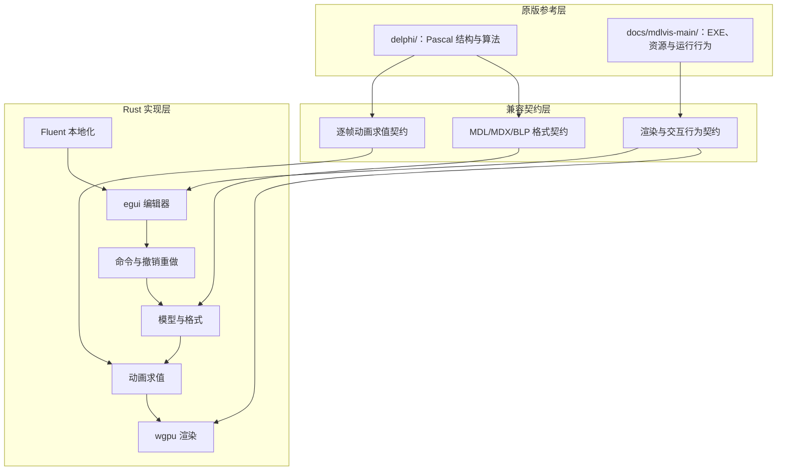
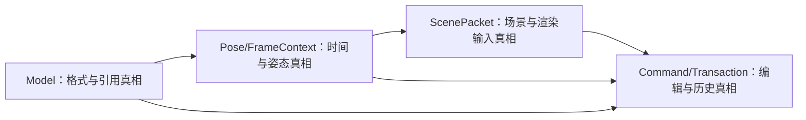

# 完整复刻基准与目标架构

## 元信息

| 项目 | 值 |
| --- | --- |
| 作者 | 项目维护者与协作者 |
| 维护人 | mdlvis-rs 维护者 |
| 状态 | 草稿 |
| 创建日期 | 2026-08-13 |
| 最后更新 | 2026-08-14 |

## 概述

本文面向实现、评审和测试人员，定义原版 MdlVis 的双路径参考基准、当前 Rust 子集的真实边界、目标架构以及“完整复刻”必须满足的可验证条件。本文不提供逐函数移植步骤，也不记录临时排查过程。

## 文档定位

- 本文回答：参考哪份原版、冲突时信谁、Rust 应形成哪些稳定边界、如何证明行为一致。
- 本文不回答：每个阶段何时完成、当前待办勾选情况；这些内容进入 `docs/plans/01-完整复刻推进计划.md`。
- 代码和可重复运行结果与本文冲突时，先记录证据并更新本文，禁止让文档覆盖真实行为。

## 真相源

| 来源 | 负责内容 |
| --- | --- |
| `delphi/*.pas`、`delphi/*.dpr`、`delphi/*.dfm` | 原版结构、算法、对象模型、文件读写、编辑命令和 UI 事件语义；由 CodeGraph 索引。 |
| `docs/mdlvis-main/mdlvis.exe` 与资源 | 原版可观察运行行为、资源、默认配置和人工对照。 |
| `docs/mdlvis-main/*.{pas,dpr,dfm}` | 原版源码镜像；2026-08-13 与 `delphi/` 的 25 个同名文件逐文件 SHA-256 相同。 |
| `src/` | Rust 当前实现。 |
| `test-data/` | 当前回归模型和纹理样本。 |
| `docs/architecture/原版功能与格式矩阵.md` | 已核对的原版窗口、菜单、命令、对象类型和格式块覆盖。 |
| `docs/architecture/验证样本与采集差异协议.md` | 当前样本清单、采集字段和尚未冻结的差异阈值。 |
| `docs/architecture/界面本地化契约.md` | 用户可见字符串的 FTL 目录、crate、语言集合和回退规则。 |
| 后续 `tests/`、快照与截图产物 | 格式、动画、渲染和编辑回归证据。 |

## 文档边界

- 本文解释稳定架构、参考优先级、功能域和验收契约。
- 本文不要求 Rust 复制 Delphi 的全局变量、VCL 控件树、OpenGL API 或内存管理方式。
- 本文不自动保留原版 bug。无法区分“兼容行为”和“历史缺陷”时，必须在计划中冻结决策并增加样本。
- 本文不把“能加载一个 MDX”当作模型格式兼容，也不把“骨架线在动”当作动画渲染正确。

## 关键图示

## 基准关系与冲突处理

### 双路径关系

`delphi/` 与 `docs/mdlvis-main/` 当前包含相同的 25 个 Pascal/DFM 工程文件，哈希完全一致。因此它们不是两个不同版本的算法基准，而是同一份源码的两个用途镜像：前者用于结构分析，后者保留 EXE、资源和运行环境。

### 冲突优先级

1. 对格式字段、算法公式和编辑语义，优先读取 `delphi/` 的源码并建立自动测试。
2. 对窗口交互、默认值、渲染顺序和难以从源码直接判断的可观察行为，以原版 EXE 的重复实验为准。
3. 两个源码目录未来哈希分叉时，先生成差异记录并确认版本身份，不得静默选择一侧。
4. 原版行为与 Warcraft III 格式规范或明显实现错误冲突时，按“缺陷不保留”处理，不设兼容/规范双模式。影响原版文件互操作的例外必须单独登记。

## 已冻结产品决策

| 决策 | 冻结结论 |
| --- | --- |
| 版本范围 | 只支持 MDL/MDX **FormatVersion / VERS 800**。读取非 800 或非 `MDLX` 魔数时返回错误，不 panic。写出永远写 800。900+ / Reforged 明确不支持，不进入 Model。 |
| 未知块 | 未识别的四CC整块保留为不透明口袋（四CC + size + 原始字节），供无编辑往返。已识别但尚未建模的块（如当前跳过的 `GLBS`、`GEOA`）必须在 M1 进入 `Model`，不得长期藏在未知口袋。无编辑往返先要求语义一致；口袋落地后要求未知块字节级一致。 |
| 原版缺陷 | 默认当作缺陷修掉，不复刻。已确认项：骨骼可见性误用 `KLAV`、写出 `KATV` 条件恒假、上下视图 `OnClick` 交叉绑定、Ctrl+X 退出而非剪切。只有“不保留就无法与原版互开文件”的行为才可登记为例外。 |
| 数值与截图阈值 | 采用采集协议中的 **v1** 门禁，见 `docs/architecture/验证样本与采集差异协议.md`。改数字必须升版本并重跑金标准。 |
| Pose 与时间 | `FrameTime=f64`；序列与全局序列使用独立显式时钟；Pose 节点以稳定 `ObjectID` 为身份；窗口、墙钟和 GPU 不得进入动画求值。`Sequence.non_looping` 强制 Clamp，作为不保留原版 UI 缺陷的有意修正。 |
| 采集方式 | 以自动采集为正式方法。Rust 必须提供无窗口结构/姿态 dump 和离屏 PNG。原版 EXE 无命令行，原版截图走后续 UI 自动化并裁客户区；新金图不得靠手截。仓库可提交协议、JSON 快照和许可清楚的小 PNG。`Arthas.mdx`、`QDMR.mdx` 不进入可再分发夹具。 |
| 首个发布 | 停在 **G3 高保真查看器**：受支持 800 模型可读取、逐帧姿态正确、材质/蒙皮/截图过门禁。对象编辑、保存重开和撤销重做属于 M4+，不挡第一版。 |

## 原版功能域

| 功能域 | 原版主要证据 | Rust 当前状态 | 目标 |
| --- | --- | --- | --- |
| 工程与主界面 | `mdlvis.dpr`、`frmmain.pas/.dfm` | 有基础窗口和若干查看面板；字符串硬编码中文 | 建立可切换语言的桌面编辑器与等价操作入口；默认 `zh-CN` |
| MDL/MDX 读写 | `mdlwork.pas` | 仅解析 MDX 子集，无完整保存 | 支持受测格式的读取、修改、保存和重开一致 |
| 3D 渲染 | `mdlDraw.pas`、`Real3D.pas` | wgpu 基础几何、纹理和多种混合管线 | 对齐层顺序、深度、混合、剔除、雾、可见性和辅助绘制 |
| 动画与骨骼 | `GetFrameData`、`InterpTBone`、`CalcTBone`、`CalcAbsolute` | 有简化控制器和骨骼层级；存在 TODO 与数据缺口 | 完整求值控制器、全局序列、层级、枢轴、蒙皮和公告牌节点 |
| 材质与纹理 | `mdlwork.pas`、`unTex.pas`、`mdlDraw.pas` | 静态层和 BLP 加载子集 | 支持材质层、纹理动画、坐标集、替换纹理、过滤与着色标志 |
| 模型对象编辑 | `objedut.pas`、`un_obj.pas`、`cabstract.pas` | 无完整编辑器 | 支持对象树、属性修改、创建、删除和引用完整性 |
| 几何与 UV 编辑 | `frmmain.pas`、`mdlwork.pas`、`guic.pas` | 仅显示与可见开关 | 支持选择、变换、镜像、分离/附加、法线、三角形和 UV 操作 |
| 动画序列编辑 | `frmmain.pas`、`addFrame.pas`、`guic.pas` | 仅播放和帧滑块 | 支持序列、关键帧和控制器编辑及即时预览 |
| 撤销重做 | `mdlDraw.pas` 等 `T*Undo` 类型 | 无统一命令历史 | 所有破坏性编辑进入可测试命令/事务历史 |
| 工具与优化 | `un_optimize.pas`、`tests.pas` | 无 | 逐项建立功能矩阵后迁移 |

## 当前 Rust 动画链事实

| 领域 | 已观察事实 | 直接后果 |
| --- | --- | --- |
| 控制器类型 | `init_from_model` 只按插值类型生成 `DontInterp/Linear/Hermite/Bezier`，没有按 Translation/Rotation/Scaling/Alpha 语义区分 | `Controller::get_frame_data` 的四元数 SLERP 分支不会由当前初始化路径命中 |
| Hermite/Bezier | 两者进入同一段 Hermite 形式计算，源码注释明确写有“简化” | Bezier 与四元数切线动画无法保证与原版一致 |
| 全局序列 | 解析并保存 `global_seq_id`，但 `get_frame_data` 不使用全局序列时间 | 使用全局序列的节点会按普通帧求值 |
| 节点标志 | `BoneState` 有 billboard 字段，但解析/初始化没有填充；插值处保留 TODO | 公告牌及轴锁定节点姿态不正确 |
| 枢轴映射 | `interp_bone` 以 `object_id` 直接索引压紧后的 `pivot_points` | ObjectID 稀疏或节点类型混排时可能取错枢轴 |
| 材质动画 | 解析器读取静态层后跳过 KMTF、KMTA 等可选轨道 | 动画纹理、透明度和部分材质状态不变化 |
| 顶点蒙皮 | GPU `Vertex` 只有位置、法线和 UV；动画更新依赖 CPU 重写顶点 | 当前架构无法直接表达完整骨骼索引/权重契约，需先冻结 CPU/GPU 蒙皮方案 |
| 测试 | CodeGraph 未发现动画核心覆盖测试 | 当前播放结果缺少数值回归保护 |
| Pose 公共契约 | `a1889c77b2d1533985137ba8d51a51c408cdcd05` 已冻结 `FrameContext`、`ResolvedFrame`、`Pose`、节点和材质结果类型；契约测试 8/8、全仓 67/67，A2 同 SHA PASS | TRACK-02、NODE-03、MATANIM-04 可共享同一时间与输出边界；旧 `AnimationSystem` 尚未迁移，不能把契约冻结误写成动画求值已经完成 |
| 确定性 Pose 求值 | `1b8221f83ceed13c4e8c4858172e30e4dd08a46a` 提供纯 `evaluate_pose`，组合 typed 轨道、九类节点 ObjectID 图和材质动画；固定 SHA 全仓 100/100、组合 golden 4/4，G2 PASS | 场景层可只消费 `Model + Pose`；旧 renderer 尚未迁移，LockX/Y/Z 与 CameraAnchored 当前明确 unsupported |
| 多 UV 公共模型 | `de47cac91b59261b508cb16021d24f65709ae936` 将 Geoset 冻结为有序 UV 集唯一真相；MDX/MDL 0/1/2 集完整往返、全仓 105/105，双格式原版打开保存重开与固定 SHA 回读 PASS | ScenePacket 可按 `Layer.CoordId` 严格选择 UV 集；renderer 当前仍只机械消费 UV0，不能误写成多 UV 渲染已完成 |

以上条目是源码观察，不等同于所有动画问题的完整根因列表；阶段 1 必须用样本和原版输出继续验证。

## 目标模块边界

| 目标模块 | 职责 | 禁止泄漏 |
| --- | --- | --- |
| `format` | MDL/MDX/BLP 词法、二进制块、版本差异和无损读写 | 不依赖 UI 或 GPU |
| `model` | 规范化对象图、稳定 ID、引用关系和编辑不变量 | 不保存临时渲染句柄 |
| `animation` | 纯函数式轨道采样、全局序列、节点局部/世界变换和可见性 | 不读取窗口时间或直接写 GPU |
| `scene` | 从模型和帧状态生成可渲染场景、蒙皮输入和选择辅助数据 | 不解析二进制文件 |
| `renderer` | wgpu 资源、管线、排序、混合、深度与截图 | 不修改模型语义 |
| `editor` | 选择、属性编辑、命令、撤销重做和文件生命周期 | 不复制格式解析逻辑 |
| `i18n` | Fluent 目录加载、当前语言、查找与回退 | 不翻译模型数据；不进入 format / animation / renderer |
| `app` | 窗口、事件循环、异步资源加载、模块编排和语言设置 | 不成为新的全局状态容器 |
| `verification` | 原版样本清单、数值快照、往返、截图和交互验收 | 不参与生产路径 |

迁移时允许先在现有目录内建立这些边界，不要求第一阶段立即重排全部文件。

## 多代理协作边界

多代理只改变实施组织方式，不改变架构真相源和验收标准。长期固定为四条泳道：主协调代理负责依赖、契约和集成；领域实现代理负责互斥写入范围内的最小实现；独立验证代理针对固定提交给出证据结论；文档代理只把已验证事实写入正式 docs。具体工作包、当前领取者和阶段状态由 `docs/plans/01-完整复刻推进计划.md` 维护。

### 必须串行冻结的共享契约

| 契约 | 生产者 | 主要消费者 | 开放下游并行的条件 |
| --- | --- | --- | --- |
| `Model` | `format` / `model` | `animation`、`scene`、`editor` | 稳定 ID、引用、轨道、枢轴、材质层和未知块策略通过结构与往返测试。 |
| `Pose/FrameContext` | `animation` | `scene`、`renderer`、预览 UI | 时间、序列、全局序列、局部/世界变换和可见性通过固定帧数值验证。 |
| `ScenePacket` | `scene` | `renderer`、选择辅助、截图验证 | CPU 参考蒙皮输入、材质层、排序键和资源引用具有稳定场景快照。 |
| `Command/Transaction` | `editor` | 对象编辑、时间轴、几何/UV、UI | 每个命令的引用修复、撤销、重做、保存和重开不变量已经冻结。 |

以上契约必须由主协调代理串行批准。领域代理不得在下游模块复制、猜测或覆盖上游语义；契约变更必须重新执行 CodeGraph impact、受影响任务重排和原门禁复验。

### 文件所有权与隔离

- 一个文件同一时刻只有一个写代理；目录所有权不得重叠，读取其它目录不自动产生写权限。
- `Cargo.toml`、`Cargo.lock`、模块入口、公共模型类型、共享测试夹具、当前计划和导航 README 是共享热点，只能由主协调代理或单独的集成任务修改。
- `delphi/` 和 `docs/mdlvis-main/` 永久只读。发现参考差异时建立证据记录，不能由实现代理“同步修正”。
- 实现代理不得同时承担本任务的最终验证；验证失败退回原写入所有者，不允许验证代理直接修生产代码。
- CPU 参考蒙皮是蒙皮数值的正确性真相源；GPU 蒙皮只能是通过相同输入输出契约后的优化路径。

### 基线、CodeGraph 与合并

每波由主协调代理固定基线提交，并在规范工作树确认工作区状态、基线测试和 CodeGraph 健康。结构探索只针对已知基线；独立工作树中的未合并变更不得假定已经进入索引。变更集成到规范工作树后，应等待索引 watcher 完成同步，再对变更公共符号执行 context/impact 检查并开放依赖波次。

合并必须绑定任务卡、实现提交和同 SHA 的独立验证回执。新提交会使旧回执失效；上游门禁失败只退回对应工作包，下游不得用补丁绕过。任务、分支、提交和交接格式以当前计划的“全局冻结契约”为准。

## 完整复刻的验收定义

| 维度 | 完成条件 |
| --- | --- |
| 功能覆盖 | 原版功能矩阵的每一项都有“已实现 / 有意不兼容 / 原版缺陷不保留”的冻结结论和证据；目标实现项通过率 100%。 |
| 格式兼容 | 仅 VERS 800 且魔数为 `MDLX` 的基准模型读取成功；非 800 / 非 MDX 明确失败；无编辑保存后重开语义一致；未知四CC经不透明口袋保留；受支持编辑保存后原版和 Rust 均可重开。 |
| 动画数值 | 在固定模型、序列和关键帧集合上，轨道值、节点世界变换、可见性和蒙皮后顶点满足计划冻结的误差阈值。 |
| 渲染结果 | 固定 GPU/分辨率/相机/帧下，对照截图通过感知差异阈值；透明层与排序另有确定性断言。 |
| 编辑一致性 | 每个编辑命令都有前置状态、操作、结果、撤销、重做、保存、重开验收。 |
| 稳定性 | 无 panic 的错误边界、损坏文件样本、资源缺失样本和长时间播放测试通过。 |
| 文档一致性 | 架构、功能矩阵、用户指南、计划状态和验收证据同步；未满足全部门禁前不得宣称“完美复刻”。 |

浮点和截图阈值以采集协议 **v1** 为准。性能基线仍由 M6 测量后单独冻结。

## 迁移原则

1. 先建立可重复基准，再改动画公式。
2. 先修模型与轨道契约，再修渲染表现；避免用矩阵补丁掩盖解析错误。
3. 每个阶段可独立编译、测试和回滚，不并行重写格式层与 UI。
4. 新 Rust 实现以语义等价为目标，不复制 Delphi 全局状态和 VCL/OpenGL 耦合。
5. 原版参考目录保持只读；新增测试夹具复制到专用验证目录并记录来源。
6. 并行度服从契约和文件隔离；高耦合阶段主动减少实现代理，不以占满代理槽为目标。
7. 每个实现任务必须经过独立验证、集成复验、CodeGraph 同步和 docs impact review 才能打开依赖门禁。

## 变更记录

| 日期 | 变更 | 说明 |
| --- | --- | --- |
| 2026-08-13 | 初始版本 | 冻结双路径基准、当前动画缺口、目标模块边界和完整复刻验收定义。 |
| 2026-08-13 | 增加多代理协作边界 | 冻结四泳道、四个串行共享契约、文件所有权、CodeGraph 与合并门禁。 |
| 2026-08-13 | 挂接功能矩阵与采集协议 | 长期架构增加已核对的功能/格式入口和样本采集真相源。 |
| 2026-08-13 | 挂接界面本地化契约 | 冻结 FTL + `fluent-templates`，默认 `zh-CN`，明确拒绝 `rust-i18n`。 |
| 2026-08-13 | 冻结首轮产品决策 | 只支持 800；未知块整块保留；原版缺陷不保留；阈值 v1；自动截图；首发停在 G3 查看器。 |
| 2026-08-14 | 冻结 Pose/FrameContext 契约 | 记录 f64 双时钟、稳定 ObjectID、类型默认值、材质结果边界及 NonLooping 强制 Clamp 的有意兼容差异；开放阶段 2 领域实现。 |
| 2026-08-14 | G2 姿态门禁通过 | 记录 typed track、稳定节点图、材质动画和纯 evaluate_pose 的固定 SHA 证据；阶段 3 可冻结 ScenePacket。 |
| 2026-08-14 | 补齐 Scene 前置多 UV 契约 | 修复 MDX/MDL 次级 UV 丢失，完成双格式原版互开门禁；ScenePacket 可冻结有序 UV 流和 CoordId 严格引用。 |
