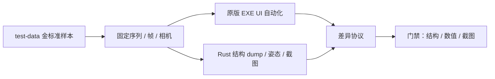

# 验证样本与采集差异协议

## 元信息

| 项目 | 值 |
| --- | --- |
| 作者 | 项目维护者与协作者 |
| 维护人 | mdlvis-rs 维护者 |
| 状态 | 已完成 |
| 创建日期 | 2026-08-13 |
| 最后更新 | 2026-08-14 |

## 概述

本文面向验证和实现人员，登记当前可用于对照的模型样本、能力标签、双端采集方法和 **v1** 差异门禁。它把“能播起来”变成可重复的结构、数值和截图证据。

## 文档定位

- 本文回答：用哪些模型证明什么能力、如何自动采集原版与 Rust 输出、差异按哪一版门禁比较。
- 本文不回答：功能是否已经实现；实现状态以源代码和当前计划为准。
- 样本清单以磁盘文件和 MDX 块头扫描为准。能力标签目前是块级证据，不是逐轨道插值统计。
- 阈值版本为 **v1（2026-08-13）**。改数字必须升版本并重跑金标准。

## 真相源

| 来源 | 负责内容 |
| --- | --- |
| `test-data/` | 当前仓库内回归模型、贴图和来源说明。 |
| `docs/mdlvis-main/mdlvis.exe` | 原版可观察运行行为；无命令行导出接口。 |
| `src/parser/`、`src/animation/`、`src/renderer/` | Rust 当前可自动采集的结构与画面。 |
| 后续 `tests/verification/` | 计划中的夹具清单、快照和截图产物。 |

## 文档边界

- 本文解释样本身份、能力标签、采集字段和 v1 差异门禁。
- 本文不把 `test-data/` 中的第三方资源授权为可再分发发布物。
- 本文不要求生产代码运行时读取 `docs/mdlvis-main/`。
- 本文不把块存在等同于该块已被 Rust 正确求值。
- `Arthas.mdx` 与 `QDMR.mdx` 只可作本地对照或负例，不得进入可再分发验证包。

## 关键图示

## 样本清单

扫描日期为 2026-08-13。块级标签来自 MDX 四CC 头，不是完整对象计数。`count` 对 SEQS/GLBS/TEXS/PIVT 按固定记录大小估算；对其余块只表示该块存在。

| 样本 | 路径 | 大小 | 魔数 / 版本 | 块级能力 | 来源与授权 | 建议角色 |
| --- | --- | --- | --- | --- | --- | --- |
| Arthas | `test-data/Arthas.mdx` | 303935 | MDLX / 800 | SEQS 13、GLBS 2、GEOS、BONE、HELP、ATCH、PIVT 66、PRE2、RIBB、EVTS、CLID；无 TXAN、无 GEOA、无 LITE、无 CAMS | 仓库已有回归样本；发布前需单独确认授权 | 层级动画金标准候选 |
| Ember Knight | `test-data/Ember Forge  Ember Knight/Ember Knight/Ember Knight_opt2.mdx` | 322581 | MDLX / 800 | SEQS 25、GLBS 4、TXAN、GEOA、LITE、HELP、ATCH、PIVT 244、PRE2、RIBB、CAMS、EVTS、CLID | [Hiveworkshop Ember Forge / Ember Knight](https://www.hiveworkshop.com/threads/ember-forge-ember-knight.318735/) | 复杂材质与完整块覆盖候选 |
| Ember Forge | `test-data/Ember Forge  Ember Knight/Ember Forge_opt2.mdx` | 261541 | MDLX / 800 | SEQS 12、GLBS 1、TXAN、GEOA、LITE、HELP、ATCH、PIVT 251、PRE2、RIBB、CAMS、EVTS、CLID | 同上 | 备用复杂模型 |
| Fire Stream | `test-data/Ember Forge  Ember Knight/Fire_Stream.mdx` | 7324 | MDLX / 800 | SEQS 3、GLBS 1、GEOS、BONE、LITE、HELP、PIVT 21、PRE2、RIBB、EVTS | 同上资源包 | 特效/发射器样本 |
| Nether Blast I | `test-data/Nether Blast/Nether Blast I.mdx` | 9440 | MDLX / 800 | SEQS 1、GLBS 1、GEOA、LITE、PIVT 12、PRE2、EVTS | [Hiveworkshop Nether Blast](https://www.hiveworkshop.com/threads/nether-blast.318806/)，作者 Vinz | 短序列特效 |
| Nether Blast II–IV | `test-data/Nether Blast/Nether Blast II.mdx` 等 | 9–11 KB | MDLX / 800 | 与 I 类似；III/IV 另有 HELP、RIBB | 同上 | 特效变体，不作为第一金标准 |
| QDMR | `test-data/QDMR.mdx` | 3708148 | `EMHM`，非 MDLX | 不是 Warcraft III MDX | 仓库已有大文件 | 错误边界：应拒绝或明确不支持 |

配套 BLP 位于 Ember Knight / Ember Forge 图标与模型目录，供纹理加载和缺失资源回退使用。仓库内目前没有 `.mdl` 文本样本。

### 首批金标准

| 角色 | 样本 | 理由 | 可再分发 | 尚未钉死的采集点 |
| --- | --- | --- | --- | --- |
| 近似静态网格 | `Nether Blast/Nether Blast I.mdx` | 1 个几何体、1 根骨骼、无父节点、无 KGRT；附带 KMTA 与 Bezier 缩放 | 是（Hive，署名 Vinz） | 序列 0 `Birth`、帧 8266、front/back；辅助叠加关闭时原版无可见几何，须与 Rust 可见性断言共同复验 |
| 层级动画 | `Arthas.mdx` | 13 个序列、2 个全局序列、深度 8、KGRT 以 Hermite 为主、最多 4 骨混合 | 否，仅本地对照 | 在修好旋转 SLERP 之前不得冻结姿态金样 |
| 复杂材质 | `Ember Forge  Ember Knight/Ember Forge_opt2.mdx` | 24 层、KMTA、TXAN、GEOA、RID 1+2 | 是（Hive，署名 Vinz / Moy） | 序列 0 `Stand`、帧 1000/3000、front/back；辅助叠加关闭 |
| 负例 | `QDMR.mdx` | 魔数 `EMHM`，不是 MDX | 否 | 期望：明确失败，不 panic |

候补：`Ember Knight_opt2.mdx`（本地 `EmberKnight.blp`）。不要用 `Fire_Stream.mdx` 当静态网格（1 个顶点）。仓库内仍缺少授权清晰、没有动画材质干扰的纯静态网格；Nether 继续保留为短序列可见性边界样本，不把原版无可见几何解释成采集失败。

原版 Full View 的主体路径只绘制 Geoset 材质层；PRE2 的 `VisParticles` 分支只是绿色四面体辅助叠加，RIBB 未进入效果绘制或模拟。v1 六槽统一关闭粒子、骨骼、网格、法线、坐标轴等辅助显示，因此不要求 Rust 实现原版不存在的粒子/飘带效果。

能力标签当前只能证明“块存在”。下列细标签仍待解析器或专用扫描器补齐：插值模式分布、旋转轨道、公告牌 flags、过滤模式枚举、KMTF/KMTA、多矩阵组。

## 采集协议

### 共同环境

每次采集必须记录：

| 字段 | 要求 |
| --- | --- |
| 样本路径与 SHA-256 | 针对复制到验证目录后的文件，不直接改 `test-data/` |
| 程序身份 | 原版：`docs/mdlvis-main/mdlvis.exe` 大小与版本信息；Rust：git SHA 与 `cargo` 构建类型 |
| 操作系统与 GPU | Windows 版本、适配器名、驱动版本 |
| 序列、帧、循环 | 序列名或索引、整数帧、是否循环 |
| 相机 | 透视、yaw/pitch、距离、目标点；分辨率 |
| 显示开关 | 几何体可见性、网格、法线、骨骼辅助是否打开 |
| 重复次数 | 同一环境连续采集两次，输出必须字节级或阈值内稳定 |

原版 EXE 无命令行导出。正式方法是 UI 自动化打开固定样本、定位到约定序列/帧、裁剪客户区。手截只允许作为自动化落地前的调试附件，不得作为新金图来源。

### 结构快照

用于证明读取覆盖，不依赖 GPU。

| 字段 | 说明 |
| --- | --- |
| `model.name` | MODL 名称 |
| `version` | VERS；非 800 不得进入金标准正面样本 |
| 计数 | 序列、全局序列、纹理、材质、层、几何体、骨骼、辅助节点、附着点、灯光、发射器、相机、事件、碰撞体、枢轴 |
| 引用 | 每个几何体的 `material_id`、顶点组与矩阵组长度 |
| 轨道摘要 | 控制器数量、插值类型、`global_seq_id`、关键帧数，不在结构快照中展开全部切线 |

建议编码：UTF-8 JSON，键名稳定排序。Rust 当前可用 `serde` 序列化 `Model`，但现有 `Model` 缺少全局序列、附着点等字段，快照必须显式标“未建模”而不是写成 0。

### 姿态快照

用于证明动画层，禁止用截图代替。

| 字段 | 说明 |
| --- | --- |
| `sequence` / `frame` | 整数帧 |
| 每个节点 | `object_id`、名称、局部平移/旋转/缩放、世界矩阵、可见性 |
| 控制器采样 | 该帧的轨道原始值，旋转同时保留四元数 |
| 全局序列 | 若节点绑定全局序列，记录重映射后的时间 |

原版在自动化导出完成前，可先用调试输出或临时插桩记录；未获得原版数值前，Rust 快照只能做自身回归，不能宣称与原版一致。

### 蒙皮快照

CPU 参考蒙皮是数值真相源。记录约定顶点（至少包围盒八角与网格中心最近顶点）的蒙皮后位置和法线。GPU 蒙皮只有在同一输入输出契约下才允许作为优化路径。

### 截图

| 项 | v1 口径 |
| --- | --- |
| 分辨率 | 1280×720，禁止窗口装饰进入画面 |
| 格式 | 无损 PNG |
| 背景 | 固定显示色 `RGB(204, 204, 204)`；若目标纹理是 sRGB，提交给渲染 API 的线性值约为 `0.6038274`，manifest 同时记录显示值与线性值 |
| 用途 | 组合证据；透明排序必须另有结构断言 |
| 原版 | UI 自动化截取工作区客户区，去掉菜单和面板 |
| Rust | wgpu 离屏或交换链回读，`COPY_SRC`；无窗口命令必须可复现同一相机 |

### 建议目录

验证产物不得写入 `delphi/` 或 `docs/mdlvis-main/`。建议后续建立：

结构 dump 已在 `src/verification/`。后续夹具、协议、截图和报告再单独建目录；当前不要用空的 `tests/` 占位。

`Arthas.mdx` 与 `QDMR.mdx` 只通过本机路径引用，不复制进可再分发夹具。

在夹具目录落地前，本文件是唯一正式协议。

## 差异协议

下列数字是 **v1（2026-08-13）** 正式门禁。改数字必须写成 v2 并重跑金标准，不得静默放宽。

| 比较项 | v1 阈值 | 失败含义 | 状态 |
| --- | --- | --- | --- |
| 结构计数 | 完全相等 | 解析丢块或模型图不完整 | v1 |
| 字符串 | 去尾零后完全相等 | 名称或路径被截断 | v1 |
| 标量轨道 | 绝对误差 `1e-4` | 插值或时间重映射错误 | v1 |
| 四元数 | 点积绝对值 `>= 1 - 1e-4`，允许 q 与 -q | 旋转插值错误 | v1 |
| 世界矩阵 / 顶点 | 绝对误差 `1e-3` | 层级、枢轴或蒙皮错误 | v1 |
| 截图 | 平均绝对误差每通道 `<= 3`，且透明层有排序断言 | 仅截图超标不得单独判定渲染正确 | v1 |
| 无编辑往返 | 语义一致；未知四CC口袋落地后另要求这些块字节级一致 | 写出丢字段 | v1 |
| 损坏 / 非 MDX / 非 800 | 返回错误，不 panic | 稳定性门禁 | v1 |

比较顺序必须与架构契约一致：先结构，再轨道值，再世界矩阵，再蒙皮顶点，最后截图。上游失败时，下游差异只作为附件，不得用渲染补丁关闭格式或动画任务。在修好 KGRT→SLERP 之前，不得把 `Arthas.mdx` 的姿态矩阵冻成金样。

## 当前采集能力

| 能力 | 原版 EXE | Rust 当前 | 缺口 |
| --- | --- | --- | --- |
| 打开/保存 MDX 800 | 可以 | 当前 Model 已建模语义可读写；unknown fourCC 与 MDVI 分舱保留 | 动态 Ribbon TextureSlot 在 MDX 不可表示并明确拒写 |
| 打开/保存 MDL 800 | 可以 | 当前 Model 已建模语义可读写 | MDVI 与 unknown binary 无可靠文本映射，保存前明确拒写 |
| 打开非 MDX / 非 800 | 可尝试 M2/WMO | `QDMR.mdx`、非 800 与损坏/截断输入均有错误回归 | 必须明确失败且不 panic |
| 结构转储 | 无官方导出 | `verification::dump_structure` 输出 JSON；G1 使用完整当前 Model JSON 做格式语义门禁 | 六槽正式 manifest 仍须补齐样本、程序、GPU、MPQ 与相机身份 |
| 逐帧姿态 | 无官方导出 | 纯 `evaluate_pose` 已覆盖序列/全局双时钟、层级、公告牌、可见性和 CPU 蒙皮输入，G2 组合 golden 已通过 | 原版没有数值导出，G3 只能把固定整数帧与截图作为组合证据 |
| 截图 | UI 自动化已能选择真实序列/视图并截取 1280×720 `GLWorkArea` 客户区 | ignored 测试可在 DX12 离屏生成共同相机六槽并验证双次 RGBA 一致 | 当前 Rust 落盘仍为 BMP；正式协议要求 PNG、同 SHA manifest 和 open/reopen 双重复 |
| 自动化 | 无命令行；受控 UI 自动化可打开/重开、选择序列、front/back、整数帧并正常退出 | 格式/姿态/场景/纹理测试及固定 DX12 offscreen 可自动执行 | 调试六槽已可比较，但 Ember 红通道 MAE 超 v1，Nether 可见性也不一致，返工后须重跑正式证据 |

## 变更记录

| 日期 | 变更 | 说明 |
| --- | --- | --- |
| 2026-08-13 | 初始版本 | 登记 `test-data/` 块级清单、金标准建议、采集字段和临时差异阈值。 |
| 2026-08-13 | 升为 v1 门禁 | 冻结金标准角色、自动采集、可再分发边界和差异阈值。 |
| 2026-08-13 | 落地结构 dump | `src/verification/` 可无窗口检查魔数/版本并导出结构快照；`QDMR` 负例通过。 |
| 2026-08-13 | 删除空 `tests/` 占位 | 采集协议 JSON 未被代码读取；测试入口仍是 `src/verification/`。 |
| 2026-08-14 | 回填 G1 双格式证据 | Ember Forge 的 Rust 写出、原版打开保存重开与 Rust 回读证明 MDX/MDL 800 关键结构保持；记录不可表示数据的安全拒写边界。 |
| 2026-08-14 | 冻结 G3 六槽与 RGB 204 背景 | Nether 采用序列 0 帧 8266，Ember 采用序列 0 帧 1000/3000，均取 front/back；记录 sRGB 目标的线性清屏值与 PRE2/RIBB 辅助显示边界。 |
| 2026-08-14 | 回填共同相机调试采集 | 双端 1280×720 已可比较；Ember 红通道 MAE 约 `3.88–4.05` 超 v1，Nether 原版无可见几何而 Rust 有微弱几何，正式 G3 仍为未通过。 |
