# 完整复刻推进计划

## 元信息

| 项目 | 值 |
| --- | --- |
| 计划编号 | 01 |
| 文档类型 | 项目计划 |
| 当前状态 | 进行中 |
| 当前阶段 | 阶段 3：G3 共同相机差异返工与同 SHA 复验 |
| 首次建立 | 2026-08-13 |
| 最后更新 | 2026-08-14 |
| 计划范围 | 通过多代理分工，对照原版 MdlVis 分阶段实现 Rust 版格式、动画、渲染、编辑和桌面交互能力 |
| 明确不含 | 未经证据确认的原版 bug 兼容；一次性无验收的大爆炸重写；逐像素复制 VCL 界面 |
| 关联目录 | `delphi/`、`docs/mdlvis-main/`、`src/`、`test-data/`、`docs/architecture/` |

## 概述

当前 Rust 工程已经具备 MDX 子集解析、基础 wgpu 渲染、纹理加载和简化动画播放，但模型动画与渲染结果存在已知问题，功能范围也远小于原版编辑器。本计划把“完整复刻”拆成有基准、有冻结契约、可独立回滚的阶段，先证明格式与动画数值，再扩展渲染和编辑功能。

实施采用“主协调—领域实现—独立验证—文档治理”四条泳道。主协调代理按波次冻结基线和共享契约，把工作拆成具有唯一写入范围的任务卡；多个实现代理只在依赖门禁开放后并行；验证代理对同一提交独立复验；文档代理依据已经通过的证据收口正式文档。

## 最终目标

- 用户状态：获得默认为简体中文、可切换语言、稳定、可读取和编辑受支持 Warcraft III 模型的 Rust 桌面应用。
- 系统状态：格式、模型、动画、场景、渲染、编辑命令和 UI 形成清晰边界，不依赖 Delphi 式全局状态。
- 验证状态：原版功能矩阵、格式往返、逐帧动画、渲染截图和编辑撤销重做均有自动化或可重复验收证据。
- 文档状态：架构、计划、功能矩阵、用户指南和验收记录与实现同步。
- 协作状态：每项实现都能追溯到任务卡、固定基线、文件所有权、实现交接、独立验证和合并门禁，不依赖代理之间的口头约定。

## 范围边界

### 本期范围

- 建立原版功能、格式块、控制器类型、节点类型、材质状态和编辑操作矩阵。
- 建立原版 EXE 与 Rust 的共同模型样本、固定帧、固定相机和输出采集方法。
- 修正 MDL/MDX 数据模型、解析和保存边界。
- 完整实现动画轨道、全局序列、节点层级、公告牌、可见性与蒙皮。
- 对齐材质、纹理、混合、排序、深度、几何辅助显示和动画渲染。
- 逐域实现原版编辑功能、命令历史、保存重开和可切换语言的桌面 UI。
- 为每个阶段补齐自动测试、人工验收表和长期文档。
- 按任务卡、波次和门禁组织多代理协作，支持任务级返工、阻塞转移和独立回滚。

### 明确不在本期

- 未确认授权或许可证边界的原版二进制/资源再分发。
- 对原版汇编优化、VCL 控件类或 OpenGL 调用的逐行机械翻译。
- 在功能和行为契约尚未冻结前进行 UI 美化或插件系统设计。
- 没有测试样本支持的“顺手兼容”格式扩展。

## 当前代码基线

| 领域 | 当前事实 | 证据 |
| --- | --- | --- |
| 原版源码 | `delphi/` 和 `docs/mdlvis-main/` 各有 25 个 `.pas/.dpr/.dfm` 文件，2026-08-13 逐文件 SHA-256 完全相同 | 本次哈希对照；`mdlvis.dpr` 原版入口 |
| 原版结构 | CodeGraph 已索引 `delphi/` 的 25 个 Pascal 文件；核心单元包括 `frmmain`、`mdlwork`、`mdlDraw`、`objedut`、`unTex`、`cabstract`、`guic`、`Real3D` | `codegraph status` 与结构探索 |
| Rust 范围 | `src/` 已覆盖应用、规范化模型、MDL/MDX 800、确定性姿态、材质动画、`ScenePacket`、CPU 蒙皮、纹理解析和 wgpu 查看器 | G1/G2 门禁与 M3 固定 SHA 记录 |
| 格式与模型 | `Model` 已承载当前 MDL/MDX 800 对象、轨道、引用、MDVI 和未知块口袋；双格式语义往返及原版保存重开通过 | G1 固定 SHA `ffae8171`、59 项全仓测试、Ember Forge 双格式证据 |
| 动画控制器 | `Pose/FrameContext`、SLERP、Hermite/Bezier、双时钟、全局序列和长时间同余已在固定帧组合测试中通过 | G2 固定 SHA `1b8221f8`、组合 golden 4/4、全仓 100/100 |
| 节点变换 | 稀疏 ObjectID、枢轴、父子层级、DontInherit、公告牌和可见性继承已进入确定性 `Pose`；LockX/Y/Z 与 CameraAnchored 明确 unsupported | G2 门禁记录与 `src/animation/skeleton.rs` |
| 材质动画 | KMTF、KMTA、TXAN、GEOA 已进入格式模型和运行时 `MaterialPose` 求值 | `M2-W1-MATANIM-04` 同 SHA PASS |
| 蒙皮与渲染 | `Model + Pose -> ScenePacket`、CPU 蒙皮、多 UV、七种过滤模式、纹理解析和固定 DX12 离屏均已接入生产查看器 | M3 Scene/SKIN/PIPE/TEX/INTEGRATE 门禁记录 |
| 验证 | `e76f680` 上串行全仓 174 PASS、5 个 ignored 专跑 PASS、真实 MPQ Nether 8/8 与 Ember 28/28 Decoded；archive 默认并行压力 22 轮失败 3 轮，正式截图协议未闭环 | A2 `M3-W2-*` 独立回执，证据在 `%TEMP%/mdlvis-g3-a2-e76f680-evidence/` |
| 共享热点 | `Model` 被多个域共同消费，`renderer.rs` 同时承担模型、CPU 蒙皮、材质和 GPU 编排，`app.rs`/`handler.rs` 聚合桌面状态 | CodeGraph context、impact 与两次只读协作审查 |
| 协作基础 | 任务卡、独占写入、实现交接、同 SHA 独立验证、CodeGraph 和 Docs 门禁已在 G1 实际执行 | 当前计划、G1 实现与验证回执 |
| 界面字符串 | 已存在 `zh-CN` / `en-US` Fluent FTL、`src/i18n.rs` 和语言设置；计划仍缺 `M0-W1-I18N-01` 的独立任务回执 | `locales/`、`src/i18n.rs`、`src/settings.rs`、提交 `578c2c9` |

## 当前缺口

1. `src/texture/archive.rs` 测试临时目录已加单调唯一后缀，串行、默认并行和 20 轮压力自测通过；生产档案读取语义未变，仍需同一提交的 A2 独立复验。
2. `src/app/app.rs` 已直接覆盖生产 `MDLVIS_WAR3_*` 非法配置并证明旧 Scene 原子保留，任务文件 rustfmt 自测通过；仍需同一提交的 A2 独立复验。
3. 双端已用共同 front/back 相机、整数帧和 RGB 204 背景完成一次 1280×720 调试采集；Ember 每通道 MAE 的红通道约为 `3.88–4.05`，超过 v1 的 `<= 3`，Nether 原版无可见几何而 Rust 有微弱绿色几何。正式门禁仍缺同 SHA 的 PNG、完整运行时/样本/MPQ manifest、open/reopen 双重复和根因返工。
4. 源码已证明 PRE2 的 `VisParticles` 只绘制绿色四面体辅助标记，RIBB 未进入 Full View 效果模拟；这不是 G3 粒子/飘带效果缺口。`N47` 随辅助显示与面板状态正式路由 M5 `TOOLS-02`。
5. 原版对象/时间轴编辑、撤销重做、几何/UV 工具、稳定性和发布仍待 M4-M6。

## 全局冻结契约

> 以下条款一经确认即为冻结项，后续阶段不得偏离，除非走变更记录流程。

1. `delphi/` 是原版源码结构分析入口；`docs/mdlvis-main/` 是原版 EXE、资源和运行行为入口。
2. 两套目录同名源码当前哈希一致；未来分叉必须先登记版本差异，禁止静默任选一份。
3. Rust 复刻以可观察语义和格式兼容为目标，不复制 Delphi 全局状态、VCL 控件树或 OpenGL API 形态。
4. 未满足全部验收门禁前，不得在正式文档或发布说明中宣称“完美复刻”或“完全一致”。
5. 每个业务阶段必须先有失败的基准测试或对照证据，再修改实现，并保留独立回滚点。
6. 格式/模型错误优先在格式与模型层修复，不用渲染器补丁掩盖；动画数值错误优先在动画层修复，不用 UI 时间补丁掩盖。
7. `docs/mdlvis-main/` 保持只读参考；生产代码不运行时依赖该目录。
8. 实施任务必须有唯一任务 ID、固定基线提交、依赖、写入所有权、禁止修改范围、交付物和验收命令；未建卡不得开始写入。
9. 同一时刻一个文件只能有一个写代理；`Cargo.toml`、`Cargo.lock`、模块入口、公共模型类型、共享夹具、当前计划和导航 README 均视为共享热点，由主协调代理或独立集成任务持有。
10. 实现代理不得自行扩大任务范围、修改正式计划状态或给自己的实现签发最终 PASS；验证代理不得顺手修改生产代码，文档代理不得把未验证结论写成事实。
11. 每个里程碑先串行冻结共享契约，再开放领域并行。`Model`、`Pose/FrameContext`、`ScenePacket`、编辑 `Command/Transaction` 是四个必须串行批准的核心契约。
12. 验证必须针对实现交接单中的同一提交 SHA；产生新提交后旧验证自动失效。只有独立验证 PASS 才可进入待合并状态。
13. 格式/模型层、动画层或场景层门禁失败时，问题退回对应任务；下游代理不得用渲染、UI 或时间轴补丁掩盖上游错误。
14. 每波开始由主协调代理固定基线并确认工作树、基线测试和 CodeGraph 健康；合并到规范工作树并等待索引同步后，才可启动依赖公共符号的下一波。
15. 活跃代理硬上限为 8 个，其中实现写代理最多 4 个、正式 docs 写代理最多 1 个；高耦合阶段以减少并发为默认选择。
16. 用户可见界面字符串使用 Fluent FTL 与 `fluent-templates`；默认语言为 `zh-CN`。`rust-i18n` 的 YAML / JSON / TOML 与 `t!` 宏不进入本仓库。细则见 `docs/architecture/界面本地化契约.md`。
17. 只支持 MDL/MDX VERS **800** 且魔数为 `MDLX`。非 800 / 非 MDX 返回错误，不 panic。写出永远写 800。未识别四CC整块保留为不透明口袋；已识别但未建模的块必须在 M1 进入 `Model`。
18. 原版历史缺陷默认不保留。已确认：`KLAV` 误用于骨骼可见性、写出 `KATV` 条件恒假、上下视图 `OnClick` 交叉、Ctrl+X 退出而非剪切。互开文件所需的例外必须单独登记。
19. 数值与截图门禁采用采集协议 **v1**。改数字必须升版本并重跑金标准。
20. 正式采集以自动化为准：Rust 无窗口 dump + 离屏 PNG；原版截图走 UI 自动化并裁客户区。新金图不得靠手截。`Arthas.mdx` 与 `QDMR.mdx` 不进入可再分发夹具。
21. 首个发布停在 **G3 高保真查看器**。对象编辑、保存重开和撤销重做属于 M4+，不挡第一版。

### 多代理角色与职责

| 编号 | 角色 | 写入边界 | 必须交付 |
| --- | --- | --- | --- |
| A0 | 主协调与集成 | 任务注册表、共享契约、共享热点、集成提交和正式门禁；原则上不承担业务实现 | 基线 SHA、派卡结果、依赖与所有权检查、集成测试、门禁结论 |
| A1 | 原版证据分析 | 功能矩阵、原版行为采集说明；`delphi/` 和 `docs/mdlvis-main/` 永久只读 | 原版源码/EXE 证据、行为差异与样本需求 |
| A2 | 独立验证 | `tests/`、验证夹具清单和基准结果目录；不写生产代码 | 同 SHA 的 PASS/FAIL/BLOCKED 回执、最小复现和证据 |
| A3 | 格式与模型实现 | `src/model/`、`src/parser/` 及后续 `src/format/`；公共契约须经 A0 批准 | 格式读取、写回、结构快照和往返测试 |
| A4 | 动画实现 | `src/animation/` | 轨道采样、层级姿态、数值测试和帧证据 |
| A5 | 场景与蒙皮实现 | 后续 `src/scene/` 及明确分配的蒙皮文件 | `Model + Pose -> ScenePacket`、CPU 参考蒙皮和数值证据 |
| A6 | 渲染实现 | `src/renderer/`、着色器；不得反向修改模型语义 | 管线、排序、GPU 资源和渲染断言 |
| A7 | 材质与纹理实现 | `src/material/`、`src/texture/`；模型字段由 A3 提交 | 材质/纹理行为、资源回退和专用样本结果 |
| A8 | 编辑核心实现 | 后续 `src/editor/` 与分配的命令测试 | 命令、撤销重做、引用修复和保存重开证据 |
| A9 | 桌面与 UI 实现 | `src/app/**`、`src/ui.rs`、`src/settings.rs`、`src/i18n.rs`、`locales/**` 与桌面生命周期 | 默认为 `zh-CN` 的可切换语言交互、文件生命周期和 UI 绑定验收 |
| A10 | 文档治理 | 正式 `docs/`、计划状态与导航；同一波唯一正式 docs 写者 | 已验证事实回填、docs impact review 和变更记录 |

A0、A2 和 A10 必须与当前被验收的实现任务保持职责独立。编号表示职责池，不等于常驻进程；同一领域确有互斥任务时可派生 `A3-1`、`A3-2` 等执行实例，任务卡仍记录真实 `agent-id`。人手不足时可以减少领域实现代理数量，但不得把独立验证省略为实现自测。

### 任务领取与交接协议

主任务卡使用 `M<里程碑>-W<波次>-<领域>-<序号>`，例如 `M2-W1-ANIM-01`。只有依赖已完成、基线 SHA 未漂移、写入范围无占用时，A0 才能将任务从“待领取”改为“执行中”。

```yaml
任务ID: M2-W1-ANIM-01
里程碑: M2
波次: W1
角色: 实现
状态: 待领取 | 执行中 | 待验证 | 返工 | 阻塞 | 待合并 | 已完成 | 已取消
目标: 单一可验证结果
基线提交: <sha>
依赖任务: []
真相源: [delphi/..., docs/mdlvis-main/...]
读取范围: [path/...]
写入所有权: [精确文件或互斥目录]
禁止修改: [path/...]
交付物: [代码, 测试, 证据]
验收命令: [cargo test ...]
验收阈值: <数值、截图或往返标准>
Docs影响: 无 | 待评估 | 指定文档
领取者: <agent-id>
```

实现代理结束时必须提交实现交接单，至少包含任务 ID、实现提交 SHA、变更文件、行为变化、自测命令及结果、证据位置、已知缺口、Docs 影响和建议验证重点。A2 对同一 SHA 返回验证回执，至少包含结论、环境、逐项结果、证据；FAIL 必须附最小复现与返工边界，BLOCKED 必须附解除条件。

```yaml
# 实现交接单
任务ID: M2-W1-ANIM-01
实现提交: <sha>
变更文件: [path/...]
行为变化: <可观察变化>
执行验证:
  - 命令: cargo test ...
    结果: PASS | FAIL
证据位置: [path/...]
已知缺口: []
Docs影响: 无 | 待评估 | 指定文档
建议验证重点: <边界和回归点>
```

```yaml
# 独立验证回执
任务ID: M2-W1-ANIM-01
验证提交: <必须等于实现提交的 sha>
结论: PASS | FAIL | BLOCKED
环境: <OS、GPU、工具链与关键配置>
检查项:
  - 规格: <验收条目>
    结果: PASS | FAIL
    证据: <路径或摘要>
失败最小复现: <仅 FAIL 必填>
返工边界: <仅 FAIL 必填>
解除条件: <仅 BLOCKED 必填>
```

### 工作空间、提交与合并门禁

- 调度环境支持独立 worktree 时，采用“一写代理一 worktree/一任务分支”，分支名使用 `task/<任务ID小写>-<主题>`；A0 持有唯一集成工作树。
- 多代理共享同一工作空间时，只允许写入集合互斥的任务并行；共享热点在该波只分配给一个代理，任何代理不得切换分支或提交其他代理的文件。
- 提交保持原子化并带任务 ID，例如 `[M2-W1-ANIM-01] 对齐旋转插值`。任务分支不得合并其他任务分支；A0 只按依赖顺序集成已经验证的 SHA。
- 合并前必须同时满足：任务卡完整、基线明确、写入集合无冲突、实现自测通过、A2 对同 SHA 判定 PASS、范围变化已登记、Docs 影响已判定、集成后相关测试通过、CodeGraph 同步健康。
- 语义冲突退回原写入所有者；A0 只处理可证明不改变语义的机械冲突并记录结果。

每波由 A0 维护以下运行时所有权表；任务进入“已完成”或“已取消”后才释放写入集合。

| 任务 ID | 代理 / 分支或工作树 | 写入所有权 | 共享热点 | 基线 SHA | 当前状态 |
| --- | --- | --- | --- | --- | --- |
| M2-W0-POSE-01 | A4 / 规范工作树 | `src/animation/types.rs` | 无 | `86425ce27fd29b86b61257c3b24da8309c23b31c` | 已完成：`a1889c77b2d1533985137ba8d51a51c408cdcd05`，A2 同 SHA PASS |
| M2-W1-TRACK-02 | A4 / 规范工作树 | `src/animation/controller.rs`、`src/animation/interpolation.rs` | 无 | `e9376537a3519c0a440a2a02108b6d5bcc63afc1` | 已完成：`ef1b1f5118d9d39d10c3dc3928b19e7b5982d902`，A2 同 SHA PASS |
| M2-W1-NODE-03 | A4 / 规范工作树 | `src/animation/skeleton.rs` | 无 | `d0dcffe49080c690458853e0cce2c1c150129c02` | 已完成：`85172dcf0457b86087a2fb4469519566965b0aba`，A2 PASS |
| M2-W1-MATANIM-04 | A7 / 规范工作树 | `src/material/animation.rs`；入口由 A0 独立集成 | `src/material/mod.rs` | `85172dcf0457b86087a2fb4469519566965b0aba` | 已完成：`2bda2c2a5f854ec389b218438fffb363cebd9aaf`，A2 同 SHA PASS |
| M2-W2-POSEVERIFY-05 | A2 / 隔离验证工作区 | 只读固定 SHA；临时组合测试不提交 | `src/animation/mod.rs` 由 A0 集成 | `1b8221f83ceed13c4e8c4858172e30e4dd08a46a` | 已完成：组合 golden 4/4、全仓 100/100，G2 PASS |
| M3-P0-MODELUV-01-R1 | A3 / 规范工作树 | `src/model/geoset.rs`、`src/parser/geoset.rs`、`src/parser/write.rs`、`src/format/mdl/{reader.rs,writer.rs,tests.rs}`、`src/renderer/renderer.rs`、`src/ui.rs` | `Geoset` 公共字段由本任务唯一持有；renderer/UI 只做编译迁移 | `f1d748b987a7a46fe29b769d60653e8e39a438a9` | 已完成：实现 `de47cac91b59261b508cb16021d24f65709ae936`，代码包 A2 PASS、全仓 105/105，MDX/MDL 双 UV 原版打开保存重开与固定 SHA 回读 PASS |
| M3-W0-SCENE-01 | A5 / 规范工作树 | `src/scene/types.rs` | `src/scene/mod.rs`、`src/main.rs` 由 A0 独立集成 | `59eb0e5879a1ea5d719bd2fd0ffdca90ef6b7881` | 已完成：实现 `cf9bacbcdf18d74a325b3a0f90075931051fff0d`，A2 同 SHA PASS；固定纯 CPU `ScenePacket` v1、canonical serde、双时钟、多 UV 和 `u32` 索引 |
| M3-W1-SKIN-02 | A5 / 规范工作树 | 新建 `src/scene/build.rs`、`src/scene/skin.rs` | `src/scene/mod.rs` 由 A0 集成；不得改 Model、Pose 或 renderer | `cf9bacbcdf18d74a325b3a0f90075931051fff0d` | 已完成：实现 `6dcc1b139a8393e4e7278cc60ad8cba1192185d8`，A2 同 SHA PASS；Scene 17/17、全仓 123/123 |
| M3-W1-PIPE-03 | A6 / 规范工作树 | `src/renderer/{renderer.rs,render.rs,vertex.rs,geoset_render_info.rs}`、`src/shader.wgsl` | `src/app/**`、`src/main.rs` 由 A0 最后接线；不得反读 Model/Pose | `cf9bacbcdf18d74a325b3a0f90075931051fff0d` | 已完成：实现 `154c3e458abd0bf53b1b18112c9bdb48335f84fd`，R1 `c90537381fb6ee41b670bff833b715636df992ea` 固定 RTX 3060 / DX12，R2 `f088426a2a13ed36ff9654b955f8bc0229a24328` 修复真实窗口 Scene uniform `COPY_DST`；A2 同 SHA PASS，Scene 25 PASS + 1 个显式 GPU 门禁、全仓 165 PASS + 1 ignored，Nether/Ember 各 10 秒窗口烟测无 validation/panic |
| M3-W1-TEX-04 | A7 / 规范工作树 | 新建 `src/texture/scene.rs`；`src/texture/{loader.rs,manager.rs}` | `src/texture/mod.rs` 由 A0 集成；不得修改 ScenePacket/renderer | `cf9bacbcdf18d74a325b3a0f90075931051fff0d` | 已完成：实现 `b277fe84db56d7d4b8efd8e81fed4af44280479d`，入口 `b488513c9e2d8851a363fd9c4fc0aa37257f1687`；A2 同 SHA PASS，全仓 131/131 |
| M2-W1-TRACK-02-R1 | A0 / 规范工作树 | `src/animation/controller.rs` | 不得改冻结 types、NODE、Scene 或 Model | `9d0ed1e728d5ac52a79362c41d768eeb2fdd771d` | 已完成：`077a06275605ec72ef519c57570d058f5b3b80aa`；原版 DontInterp 零四元数单键按 identity 求值，A2 PASS |
| M3-W2-INTEGRATE-05-R1 | A8 / 规范工作树 | `src/app/app.rs`、`src/app/handler.rs` | `src/main.rs`、renderer/scene/texture 公共合同不可改；A0 最后集成 | `c90537381fb6ee41b670bff833b715636df992ea` | 已完成：实现 `1c5ccd1bf73f893c889d5138b598bc3925c77b2e`，共享 accessor/snapshot 前置为 `27f4a8b`/`de0aba8`；在集成 SHA `f088426a2a13ed36ff9654b955f8bc0229a24328` 上 A2 PASS。唯一生产链为 `evaluate_pose -> build_scene_packet -> resolve textures -> update_scene_with_textures`，事务加载、粘性错误、双时钟和 legacy 单画门禁通过 |
| M3-W2-VIEWVERIFY-05 | A2+A1 / 隔离验证环境 | 只读固定 SHA；证据仅写 `%TEMP%/mdlvis-g3-viewverify/`，不提交本机 PNG/原版运行镜像 | A0 持有正式 docs/入口；不得修改 Model/Pose/ScenePacket/renderer/texture 语义 | `e76f68052be128d9dd0a6fef58a63364f931bcb9` | **A1 FAIL / A2 BLOCKED**：Rust 结构、Pose、纹理解码和 DX12 1280×720 双次 RGBA 稳定；原版全窗重复哈希稳定且旧 MPQ 纯背景阻断已解除，但当前 2560×1315 图片含 UI/网格/轴，缺固定帧、相机、运行时和 MPQ manifest，不能执行 v1 MAE。须重跑旧 1280×720 GLWorkArea 脚本并让 Rust 使用同一 camera contract |
| M3-W1-PIPE-03-R3 | A6 / 规范工作树 | `src/renderer/geoset_render_info.rs`、`src/renderer/renderer.rs` | 不改 WGSL、ScenePacket、Model 或生产三角索引；A0 不并行写 renderer | `58f75d502791f47ca6a2083da234e140a7790401` | 已完成：`5567eb940ab2cfee7d38a6604a41ac1d9379d866` 冻结跨 API 绕序与剔除 |
| M3-W2-ARCHIVETEX-06-R2 | A7 / 规范工作树 | `src/texture/archive.rs` | `Cargo.toml`、`Cargo.lock`、`src/texture/mod.rs` 由 A0 原子集成；不得硬编码本机路径、读取注册表、联网或提交 Warcraft 资产 | `e76f68052be128d9dd0a6fef58a63364f931bcb9` | **A2 FAIL**：串行 7/7、真实 MPQ 和功能断言 PASS；默认并行压力 22 轮失败 3 轮，失败仅在测试临时目录并发清理冲突 |
| M3-W2-ARCHIVEINTEGRATE-07-R1 | A0 / 规范工作树 | `src/app/app.rs` 及同文件测试 | 只消费 ARCHIVETEX 公共源；不得把路径/MPQ 句柄写入 Model、Pose、ScenePacket 或 renderer | `e76f68052be128d9dd0a6fef58a63364f931bcb9` | **A2 FAIL**：生产功能与组合证据 PASS；缺生产环境变量错误到旧 Scene 保留的直接贯通测试，且新增测试区域未通过 rustfmt |
| M3-W2-ARCHIVETEX-06-R3 | A7 / 规范工作树 | 仅 `src/texture/archive.rs` 测试辅助与测试 | 不得修改生产档案读取语义、Cargo、模块入口或 app | `e76f68052be128d9dd0a6fef58a63364f931bcb9` | 待验证：单调唯一临时目录后缀已落地；串行 7 PASS / 1 ignored、默认并行 PASS、20 轮压力 20/20 PASS |
| M3-W2-ARCHIVEINTEGRATE-07-R2 | A0 / 规范工作树 | 仅 `src/app/app.rs` 集成测试与 G3 ignored 采集测试 | 不得修改 Model/Pose/ScenePacket/renderer/texture 生产语义；不得与其他任务并行写 app.rs | `e76f68052be128d9dd0a6fef58a63364f931bcb9` | 执行中：生产环境错误原子性测试与共同相机六槽自测已通过；正式 PNG、完整 manifest 与同 SHA 复验未完成 |
| M3-W2-VIEWVERIFY-05-R1 | A1+A2 / 隔离验证环境 | 仓库只读；证据写 `%TEMP%/mdlvis-g3-viewverify/<新 SHA>/` | ARCHIVETEX-06-R3、ARCHIVEINTEGRATE-07-R2 | 待新集成 SHA | 执行中：调试六槽已获得真实 sequence/view 与 1280×720 工作区；Ember 红通道 MAE 超 v1、Nether 可见性不一致，正式结论等待完整 manifest、PNG、open/reopen 双重复和返工提交 |

### 失败、阻塞、返工与范围变更

- FAIL：任务退回原实现代理且保留写入所有权；连续两轮同类失败由 A0 重拆任务或冻结争议契约。
- BLOCKED：记录“缺样本/缺决策/环境/上游契约”等类别、已尝试项、证据、解除条件和可继续任务。只有关键路径无其他可执行任务时，才把总计划改为阻塞。
- 返工：只修改失败边界内的写入集合，不顺手重构；新提交必须重新独立验证。
- 范围变更：先登记来源、原因、影响里程碑、契约、文件、测试、Docs 和取舍，由 A0 判定纳入当前波、排入后续波或明确不兼容。
- 取消：不合并半成品，保留任务记录、提交 SHA、取消原因与后续接续点。

## 首轮待冻结决策

- [x] 原版双路径的用途和冲突优先级。
- [x] 采用分阶段演进，不进行一次性全量重写。
- [x] “完整复刻”必须由功能矩阵与自动/可重复验收定义。
- [x] 采用四泳道多代理协作、唯一写入所有权和独立验证回执。
- [x] 活跃代理上限 8 个、实现写代理上限 4 个、正式 docs 写代理上限 1 个。
- [x] CPU 参考蒙皮作为正确性真相源；GPU 蒙皮仅作为通过数值门禁后的可选优化。
- [x] 界面目录使用 Fluent FTL + `fluent-templates`；默认 `zh-CN`；不采用 `rust-i18n`。
- [x] 只支持 VERS 800；未知四CC整块保留；已识别块必须进入 `Model`。
- [x] 原版历史缺陷默认不保留；不设兼容/规范双模式。
- [x] 浮点、蒙皮和截图差异采用采集协议 v1 门禁。
- [x] 正式采集以自动 dump / 离屏截图为准；原版走 UI 自动化；暴雪/未知样本不进可再分发夹具。
- [x] 首个发布停在 G3 高保真查看器；编辑器不挡第一版。

## 里程碑总览

| 里程碑 | 目标 | 截止日期 | 负责人 | 状态 |
| --- | --- | --- | --- | --- |
| M0 | 双基准、功能矩阵、样本和验收规格冻结 | 待排期 | A0 + A1 + A2 + A10 | 已完成 |
| M1 | MDL/MDX 规范化模型与读取/保存回归 | 待排期 | A0 + A3 + A2 + A10 | 已完成 |
| M2 | 轨道采样、节点层级和逐帧姿态对齐 | 待排期 | A0 + A4 + A7 + A2 + A10 | 已完成 |
| M3 | 蒙皮、材质、纹理和渲染截图对齐 | 待排期 | A0 + A5 + A6 + A7 + A2 + A10 | 进行中 |
| M4 | 原版模型对象与动画编辑能力迁移 | 待排期 | A0 + A8 + A9 + A2 + A10 | 待定 |
| M5 | 几何/UV 工具、撤销重做与保存重开 | 待排期 | A0 + A8 + A9 + A2 + A10 | 待定 |
| M6 | 全功能矩阵收口、稳定性、用户指南和发布验收 | 待排期 | A0 + A2 + A10 | 待定 |

### 并行波次总览

```mermaid
flowchart LR
    M0["M0：证据、样本、阈值"] --> G0{"G0 基准门禁"}
    G0 --> MC["M1-W0：Model 契约"]
    MC --> M1["M1-W1：MDX/MDL 读写并行"] --> G1{"G1 格式门禁"}
    G1 --> PC["M2-W0：Pose/FrameContext 契约"]
    PC --> M2["M2-W1：轨道/层级/材质动画并行"] --> G2{"G2 姿态门禁"}
    G2 --> SC["M3-W0：ScenePacket 契约"]
    SC --> M3["M3-W1：蒙皮/渲染/纹理并行"] --> G3{"G3 查看器门禁"}
    G3 --> EC["M4-W0：Command/Transaction 契约"]
    EC --> M4["M4-W1：对象/关键帧/UI 并行"] --> G4{"G4 编辑器门禁"}
    G4 --> M5["M5-W1：几何/工具/桌面并行"] --> G5{"G5 功能门禁"}
    G5 --> M6["M6：稳定性与发布"] --> G6{"G6 发布门禁"}
```



每轮固定四拍：A0 冻结基线并派卡；实现代理并行交付；A2 按完成顺序流水验证；A0 集成且 A10 完成文档收口。默认不跨里程碑并行，只有下一任务明确不读取未冻结契约时才允许例外。

| 阶段 | 推荐活跃编组 | 实现写代理上限 | 说明 |
| --- | --- | --- | --- |
| M0 | 1 协调 + 3 证据分析 + 2 验证/样本 + 1 文档 | 0 | 以只读分析和基线建设为主。 |
| M1 | 1 协调 + 3 格式实现 + 2 验证 + 1 文档 | 3 | `Model` 契约冻结后才并行读写器。 |
| M2 | 1 协调 + 2 动画/材质实现 + 2 验证 + 1 文档 | 2 | 高耦合，避免同时改公共轨道类型。 |
| M3 | 1 协调 + 3 蒙皮/渲染/纹理实现 + 2 验证 + 1 文档 | 3 | `ScenePacket` 冻结后隔离 CPU 与 GPU。 |
| M4-M5 | 1 协调 + 最多 4 实现 + 2 验证 + 1 文档 | 4 | 按命令、几何、UI 和文件生命周期拆分。 |
| M6 | 1 协调 + 1 发布实现 + 3 专项验证 + 1 文档 | 1 | 以收口和独立验收为主。 |

## 阶段详述

### 工作包注册表

下表是可直接派发的主干工作包；开始执行时，A0 必须把对应行复制为完整任务卡，并把“建议写入所有权”收紧到当前任务实际需要的精确文件。任务可继续拆小，但不得合并成跨越多个冻结契约的大任务。

除 A10 的文档任务外，所有工作包默认禁止修改正式 `docs/`；除 A0 的集成任务外，默认禁止修改共享热点；所有工作包均禁止修改两个原版参考目录。注册表共 27 个交付工作包和 7 个阶段门禁。

| 工作包 | 主责 / 验证 | 交付物 | 前置依赖 | 建议写入所有权 | 门禁 |
| --- | --- | --- | --- | --- | --- |
| M0-W0-EVID-01 | A1 / A2 | 原版菜单、窗口、格式块、对象、命令和快捷键证据矩阵 | 无 | 只读分析；A10 写正式矩阵 | 证据可定位、目标状态完整 |
| M0-W0-SAMPLE-02 | A2 / A0 | 金标准样本与能力标签清单 | 无 | 验证夹具清单；参考目录只读 | 来源、哈希、授权和能力标签齐全 |
| M0-W0-CAPTURE-03 | A1+A2 / A0 | 原版 EXE 与 Rust 的固定帧、相机和输出采集协议 | SAMPLE-02 | 验证工具与结果目录 | 双端重复采集稳定 |
| M0-W0-DIFF-04 | A2 / A0 | 结构、数值、截图和编辑往返的差异协议 | CAPTURE-03 | 验证配置和测试 | 临时阈值有版本与审批记录 |
| M0-W1-I18N-01 | A9 / A2 | 接入 `fluent-templates`，抽出当前查看器字符串，提供 `zh-CN` / `en-US` 与语言切换 | 无；不阻塞 G0 | `locales/**`、`src/i18n.rs`、`src/ui.rs`、`src/settings.rs`、`src/texture/panel.rs`；`Cargo.toml` 由 A0 集成 | 首波 key 齐全、缺 key 不 panic、默认措辞不变 |
| G0-BASELINE | A0 / A2+A10 | 基准门禁报告 | EVID-01 至 DIFF-04 | 计划状态与门禁记录 | M0 验收全部通过 |
| M1-W0-MODEL-01 | A3 / A0+A2 | 规范化 `Model`、稳定 ID、引用和未知块契约 | G0 | `src/model/**`；入口文件由 A0 集成 | 契约评审和结构测试通过 |
| M1-W1-MDXR-02 | A3 / A2 | MDX 完整读取与错误边界 | MODEL-01 | 后续 `src/format/mdx/read/**` 或任务卡指定解析文件 | 样本结构快照通过 |
| M1-W1-MDL-03 | A3 / A2 | MDL 文本读取/写入 | MODEL-01 | 后续 `src/format/mdl/**` | 文本往返与原版重开通过 |
| M1-W1-MDXW-04 | A3 / A2 | MDX 写入、未知块策略与语义往返 | MODEL-01 | 后续 `src/format/mdx/write/**` | Rust/原版重开、引用完整 |
| G1-FORMAT | A0 / A2+A10 | 格式门禁报告 | MDXR-02、MDL-03、MDXW-04 | 共享模块入口与正式文档 | 格式回归与 CodeGraph 同步通过 |
| M2-W0-POSE-01 | A4 / A0+A2 | `Pose/FrameContext`、时间、序列和全局序列契约 | G1 | `src/animation/types.rs` 及任务卡指定公共类型 | 纯函数接口与样本预期冻结 |
| M2-W1-TRACK-02 | A4 / A2 | 标量、向量、四元数轨道和插值求值 | POSE-01 | `src/animation/controller.rs`、`interpolation.rs` | 固定帧数值通过 |
| M2-W1-NODE-03 | A4 / A2 | 节点层级、枢轴、标志、公告牌和可见性 | POSE-01 | `src/animation/skeleton.rs` | 世界矩阵与边界样本通过 |
| M2-W1-MATANIM-04 | A7 / A2 | 材质 alpha、纹理 ID/坐标动画求值 | POSE-01 | `src/material/**` 与任务卡指定模型字段 | 专用轨道样本通过 |
| M2-W2-POSEVERIFY-05 | A2 / A0 | 轨道、层级和材质动画组合回归 | TRACK-02、NODE-03、MATANIM-04 | `tests/` 与验证结果 | 组合样本无漂移 |
| G2-POSE | A0 / A2+A10 | 姿态门禁报告 | POSEVERIFY-05 | 计划、架构与共享入口 | 无 GPU 即可证明姿态正确 |
| M3-W0-SCENE-01 | A5 / A0+A2 | `Model + Pose -> ScenePacket` 场景契约 | G2 | 后续 `src/scene/types.rs` 与公共接口 | 场景快照冻结 |
| M3-W1-SKIN-02 | A5 / A2 | CPU 参考蒙皮、法线和多矩阵组 | SCENE-01 | 后续 `src/scene/skin/**` | 顶点/法线数值通过 |
| M3-W1-PIPE-03 | A6 / A2 | 混合、深度、剔除、排序和 GPU 管线 | SCENE-01 | `src/renderer/**`、着色器 | 状态断言和固定截图通过 |
| M3-W1-TEX-04 | A7 / A2 | BLP、替换纹理、Wrap、队伍色和缺失资源 | SCENE-01 | `src/material/**`、`src/texture/**` | 纹理专用样本通过 |
| M3-W2-VIEWVERIFY-05 | A2 / A0 | 固定环境组合截图与结构回归 | SKIN-02、PIPE-03、TEX-04 | `tests/`、基准结果 | 数值和截图组合通过 |
| M3-W1-PIPE-03-R3 | A6 / A2 | 冻结跨 API 正面定义并修正 GPU fixture 绕序证据 | PIPE-03-R2 | `src/renderer/geoset_render_info.rs`、`src/renderer/renderer.rs` | 非对称单三角正/反/TwoSided DX12 读回与既有材质离屏回归通过 |
| M3-W2-ARCHIVETEX-06-R2 | A7 / A2 | 纯 Rust `wow-mpq` 只读纹理源 | TEX-04 | `src/texture/archive.rs`；Cargo 与模块入口由 A0 集成 | 自造 MPQ 证明 patch > expansion > base；真实 war3.mpq 读取仍为 ignored 环境测试 |
| M3-W2-ARCHIVEINTEGRATE-07-R1 | A0 / A2 | 把模型目录与档案纹理源原子接入生产查看器 | ARCHIVETEX-06-R2、INTEGRATE-05-R1 | `src/app/app.rs` 及同文件测试 | 未配置保持 Missing fallback；配置后 model-local 优先于档案；失败不污染旧 Scene |
| M3-W2-ARCHIVETEX-06-R3 | A7 / A2 | 修复档案测试临时目录并发冲突，不改变生产读取语义 | ARCHIVETEX-06-R2 的 A2 FAIL | `src/texture/archive.rs` 测试代码 | 默认并行与 20 轮压力无 flake |
| M3-W2-ARCHIVEINTEGRATE-07-R2 | A0 / A2 | 补生产环境配置原子失败测试，并恢复共同相机 Rust 六槽 | ARCHIVEINTEGRATE-07-R1 的 A2 FAIL | `src/app/app.rs` 测试代码 | 直接覆盖旧 Scene 保留；六槽 manifest 可与原版一一对应 |
| M3-W2-VIEWVERIFY-05-R1 | A1+A2 / A0 | 同 MPQ、同帧、同相机的原版/Rust 1280×720 组合复验 | ARCHIVETEX-06-R3、ARCHIVEINTEGRATE-07-R2 | 只读仓库；临时证据目录 | 双端重复稳定、v1 MAE 与结构断言有正式结论 |
| G3-VIEWER | A0 / A2+A10 | 高保真查看器门禁报告 | VIEWVERIFY-05 | 集成入口与正式文档 | 查看器回归、索引和 Docs 门禁通过 |
| M4-W0-COMMAND-01 | A8 / A0+A2 | `Command/Transaction`、引用修复和撤销重做契约 | G3 | 后续 `src/editor/command/**` | 操作/撤销/重做不变量冻结 |
| M4-W1-OBJECT-02 | A8 / A2 | 对象创建、删除、重命名、父子和属性编辑 | COMMAND-01 | 后续 `src/editor/object/**` | 编辑与保存重开通过 |
| M4-W1-TIMELINE-03 | A8 / A2 | 序列、控制器、关键帧和复制粘贴 | COMMAND-01 | 后续 `src/editor/timeline/**` | 时间轴编辑往返通过 |
| M4-W1-UI-04 | A9 / A2 | 编辑命令的可切换语言 UI 绑定和文件生命周期 | COMMAND-01 | `src/app/**`、`src/ui.rs`、`src/settings.rs`、`src/i18n.rs`、`locales/**` | UI 不绕过命令层；新字符串先补 FTL |
| G4-EDITOR | A0 / A2+A10 | 核心编辑器门禁报告 | OBJECT-02、TIMELINE-03、UI-04 | 集成入口与正式文档 | 编辑矩阵和保存重开通过 |
| M5-W0-GEOMETRY-01 | A8 / A2 | 几何、法线、三角形和 UV 命令 | G4 | 后续 `src/editor/geometry/**`、`uv/**` | 几何不变量、撤销和重开通过 |
| M5-W0-TOOLS-02 | A9 / A2 | 优化、检查、纹理管理、快捷键和辅助窗口 | G4 | 分配的工具/UI 文件 | 本阶段功能矩阵 100% 有结论 |
| G5-FEATURE | A0 / A2+A10 | 全目标功能门禁报告 | GEOMETRY-01、TOOLS-02 | 集成入口与正式文档 | M5 验收全部通过 |
| M6-W0-STABILITY-01 | A2 / A0 | 损坏文件、资源缺失、长时播放、大模型和性能回归 | G5 | `tests/`、验证结果 | 稳定性与性能基线通过 |
| M6-W0-RELEASE-02 | A0+A10 / A2 | 发布构建、默认为 `zh-CN` 的指南、兼容表和已知限制 | STABILITY-01 | 发布配置与正式文档 | 独立发布验收通过 |
| G6-RELEASE | A0 / A2+A10 | 最终门禁、长期事实回填和计划归档 | RELEASE-02 | 集成、计划与归档索引 | 所有目标项有证据或正式豁免 |

### 阶段 0：基准与契约冻结

**目标**：把“看起来像原版”转成可执行的功能、格式、数值、截图和编辑验收规格。

**代理编组**：A0 协调；A1 负责源码/EXE 证据；A2 负责样本、采集和差异协议；A10 负责正式文档。格式/动画/渲染不安排生产代码写入。A9 可并行执行 I18N-01，只改桌面字符串与 `locales/`。

**任务拆分与文件所有权**：执行 EVID-01、SAMPLE-02、CAPTURE-03、DIFF-04；原版目录只读，验证资产由 A2 单写，正式 docs 由 A10 单写。I18N-01 可由 A9 并行抽出当前查看器字符串，不写入格式/动画代码，也不作为 G0 前置。

**波次门禁**：G0 必须由 A2 复验，A0 批准，A10 完成 Docs 影响检查。

**阶段冻结契约**：
> 1. 每个后续功能必须能映射到原版源码入口、原版运行行为或明确的不兼容决策。
> 2. 基准模型、序列、帧和相机参数必须版本化且可重复。

**待办清单**：
- [x] 建立 CodeGraph 索引并确认 Rust/Pascal 覆盖。
- [x] 验证两套 Delphi 源码镜像哈希一致。
- [x] 建立目标架构和初始计划。
- [x] 冻结界面本地化契约：Fluent FTL、`fluent-templates`、默认 `zh-CN`。
- [x] 产出原版功能矩阵，覆盖菜单、窗口、格式块、对象类型、编辑命令和快捷键。
- [x] 为现有 `test-data/` 模型建立块级能力标签；细标签仍待解析器补齐。
- [x] 选定首批金标准角色：`Nether Blast I`、`Arthas.mdx`（仅本地）、`Ember Forge_opt2.mdx`；负例 `QDMR.mdx`。
- [x] 建立结构、轨道、世界矩阵、蒙皮和截图采集字段；机器可读协议待姿态/截图工具落地后再写入。
- [x] 落地无窗口结构 dump：`src/verification/` + `cargo test --bin mdlvis-rs verification`。
- [x] 冻结版本范围、v1 误差阈值、未知块策略和原版缺陷不保留。

**验收规格**：
- [x] 功能矩阵中的每项有原版证据位置和目标状态。
- [x] 至少一个静态模型、一个层级动画模型、一个复杂材质模型可以生成双端自动基准。
- [x] 基准采集重复两次输出稳定，环境信息被记录。
- [x] 首轮待冻结决策全部确认。

**阶段出口条件**：M0 文档、样本清单、采集工具和验收阈值完成评审；G0 独立验证 PASS、CodeGraph 健康且 docs impact review 完成，此后才能重写动画核心。

**依赖**：可运行的原版 EXE、Windows 图形环境、测试模型授权与稳定 CodeGraph 索引。

### 阶段 1：格式与规范化模型

**目标**：建立足以承载原版功能的 Rust 模型图和 MDL/MDX 读取/保存契约。

**代理编组**：A0 协调；A3 在 `Model` 契约冻结后最多拆成 3 个互斥写入任务；A2 独立验证；A10 收口文档。

**任务拆分与文件所有权**：先串行执行 MODEL-01，再并行执行 MDXR-02、MDL-03、MDXW-04。公共模型类型由 MODEL-01 的唯一写者持有，三个读写任务不得同时修改同一解析文件。

**波次门禁**：G1 前必须完成结构快照、MDL/MDX 往返、原版重开、CodeGraph 影响检查和 Docs 影响检查。

**阶段冻结契约**：
> 1. 格式层不依赖 UI/GPU。
> 2. 只读 VERS 800 / `MDLX`；未知四CC进不透明口袋；已识别块必须进入 `Model`。

**待办清单**：
- [x] 按原版读写过程列出 MDL/MDX 块与对象覆盖矩阵。
- [x] 设计稳定 ID、节点、轨道、材质层、引用完整性和未知块口袋。
- [x] 用边界检查替换已实现块中依赖跳读的脆弱解析路径。
- [x] 实现结构快照、无编辑语义往返和保存后重开测试。
- [x] 增加损坏、截断、未知块和非 800 / 非 MDX 错误测试。

**验收规格**：
- [x] 金标准模型结构快照达到冻结覆盖率。
- [x] 无编辑往返满足冻结的字节或语义一致策略。
- [x] 保存结果可由原版和 Rust 重开，引用不悬空。

**G1 门禁记录（2026-08-14）**：最终格式代码基线为 `ffae8171523130b544b1aa33aba808adef882a6b`。A2 在固定 SHA 的隔离副本中复验 MDL 14/14、全仓 59/59；MDX 收口提交 `cb2c4e8c33178cbc1d9196e6828c7f108a8603ce` 已独立通过 load 3/3、writer 15/15、全仓 58/58，并对四个复杂样本完成首次 `load -> write -> load` 的完整当前 `Model` 语义比较。CodeGraph 已同步，目标文件无漂移；严格 Clippy 仍被 45 个既存非格式告警阻断，格式任务文件零命中。

原版互开门禁使用 `Ember Forge`：MDX 在 Rust 写出后由原版打开、保存、重开，再由 Rust 回读，保持 11 个 Geoset、313 个 Controller、18 个 Ribbon、136 个 PRE2 和 32 字节 MDVI；MDL 在修正 Geoset `Bounds -> Tail` 顺序后执行同一闭环，保持 Geoset `11 -> 11`、首块 `unselectable=false`、Controller 313、Ribbon 18 和 PRE2 136。两种格式均正常退出且无错误对话框。G1 结论为 **PASS**；支持边界见《原版功能与格式矩阵》：只承诺 VERS 800 和当前 `Model` 已建模语义，不能表示的数据在创建或截断目标前明确拒写。

**阶段出口条件**：动画阶段所需的所有节点、轨道、枢轴、矩阵组和材质动画数据不再被解析器丢弃；G1 独立验证、集成测试、CodeGraph 同步和 docs impact review 均通过。

**依赖**：阶段 0 格式矩阵、样本和未知块策略。

### 阶段 2：动画求值与节点层级

**目标**：逐帧对齐控制器采样、本地变换、世界变换、可见性、全局序列和公告牌行为。

**代理编组**：A0 协调；A4 负责轨道和层级，A7 负责材质动画；A2 负责数值与组合验证；A10 收口文档。实现写代理最多 2 个。

**任务拆分与文件所有权**：先串行执行 POSE-01，再按互斥文件并行执行 TRACK-02、NODE-03、MATANIM-04，最后由 A2 执行 POSEVERIFY-05。

**波次门禁**：G2 不接受仅凭播放画面的结论，必须以无 GPU 的固定帧轨道值、世界矩阵和长时间循环证据为准。

**阶段冻结契约**：
> 1. 动画求值是与窗口和 GPU 无关的确定性函数。
> 2. 时间、序列和全局序列由显式上下文传入。
> 3. `FrameTime` 使用 `f64` 绝对 MDL 帧；`FrameContext` 分别携带序列时钟、独立全局时钟、播放模式和可选视图基。
> 4. `Pose` 的节点表按稳定 `ObjectID` 排序并建立查找表；稀疏 ID 合法，重复 ID 返回稳定错误，数组位置不得充当身份。
> 5. LocalTransform、节点可见性和材质动画结果使用有类型默认值；后续轨道、节点和材质求值共同消费同一 `ResolvedFrame`。

`M2-W0-POSE-01` 已在 `a1889c77b2d1533985137ba8d51a51c408cdcd05` 冻结上述公共契约。实现定向测试 8/8、全仓 67/67；A2 在固定 SHA 的隔离副本得到相同结果并确认 CodeGraph 同步。序列 Loop 保留精确结束帧，区间外使用 `rem_euclid`；零时长全局序列由 TRACK-02 取首关键帧或类型默认值。`Sequence.non_looping` 强制 Clamp 是有意修复原版 MdlVis UI 忽略该格式标志的历史缺陷，不宣称与原版播放器一致。

**待办清单**：
- [x] 冻结 `Pose/FrameContext`、双时钟、稳定 ObjectID 和有类型默认值契约。
- [x] 分离轨道值类型与插值模式，正确处理旋转 SLERP 及 Hermite/Bezier 切线。
- [x] 对齐区间外取值、序列边界、非循环和全局序列。
- [x] 修正 ObjectID、枢轴、父子层级和节点标志映射。
- [x] 实现完整公告牌与可见性继承；LockX/Y/Z 和 CameraAnchored 无可证明原版公式，当前稳定拒绝并转后续证据包。
- [x] 建立固定帧轨道值、世界矩阵、材质结果和长时间循环组合测试。

**验收规格**：
- [x] 金标准帧的轨道值和世界矩阵满足冻结误差阈值。
- [x] 非连续 ObjectID、混合节点类型和深层级样本通过。
- [x] 全局序列和序列循环在长时间播放中无漂移。

G2 绑定 `1b8221f83ceed13c4e8c4858172e30e4dd08a46a`，A2 在固定 SHA archive 中得到入口 2/2、TRACK 14/14、NODE 10/10、MATANIM 7/7、全仓 100/100；独立组合 golden 4/4 覆盖序列与全局双时钟、跨 owner 深链、稀疏 pivot、DontInherit、公告牌、父链可见性、KMTA/KMTF/TXAN/GEOA、重复与乱序求值纯度、巨大正负时钟同余和坏引用 Err 不 panic。门禁结论为 **PASS**。LockX/Y/Z 与 CameraAnchored 保留为明确 unsupported，不计入已实现范围。

**阶段出口条件**：动画数值在不启动渲染器时即可证明与原版一致；G2 独立验证、集成测试、CodeGraph 同步和 docs impact review 均通过。

**依赖**：阶段 1 模型与轨道契约。

### 阶段 3：蒙皮与渲染对齐

**目标**：把正确动画状态映射为正确顶点、材质层和最终画面。

**代理编组**：A0 协调；A5 负责场景/CPU 蒙皮，A6 负责渲染器，A7 负责材质纹理；A2 组合验证；A10 收口文档。实现写代理最多 3 个。

**任务拆分与文件所有权**：先串行执行 SCENE-01，再并行执行 SKIN-02、PIPE-03、TEX-04，最后执行 VIEWVERIFY-05。A6 只能消费 `ScenePacket`，不得反向修改 `Model` 或 `Pose`。

**波次门禁**：G3 同时要求 CPU 参考蒙皮数值、渲染状态断言和固定环境截图通过；截图不得作为唯一证据。

**阶段冻结契约**：
> 1. 渲染器消费规范化场景，不修改模型语义。
> 2. 混合、深度、排序、剔除和纹理寻址均有独立测试或截图证据。

**待办清单**：
- [x] 冻结并实现 CPU/GPU 蒙皮方案、法线变换和多矩阵组权重。
- [x] 实现 GeosetAnim、材质 alpha、纹理 ID/坐标动画和多 UV 集。
- [x] 对齐 Opaque、Transparent、Blend、Additive、AddAlpha、Modulate、Modulate2x。
- [x] 对齐双面、无雾、深度测试/写入、层顺序和透明排序。
- [x] 对齐队伍颜色/辉光、Wrap、缺失纹理和 BLP 行为。
- [ ] 让生产查看器与原版从同一份显式本地 Warcraft MPQ 解析 tracked 样本普通 BLP，禁止联网和提交资产。
- [ ] 用模型空间绕序正确的非对称单三角冻结 GL/WebGPU 正面与 TwoSided 的固定 GPU 证据。
- [ ] 建立固定环境截图和结构性渲染断言。

**验收规格**：
- [x] 蒙皮后关键顶点和法线满足冻结误差阈值。
- [x] 所有过滤模式和关键着色标志通过专用模型。
- [ ] 金标准截图通过冻结阈值且连续重复稳定。

**阶段出口条件**：高保真查看器里程碑通过；动画播放、相机和材质表现有完整回归保护；G3 独立验证、集成测试、CodeGraph 同步和 docs impact review 均通过。

**依赖**：阶段 2 动画状态与阶段 0 截图基准。

### 阶段 4：对象与动画编辑

**目标**：迁移原版对象树、属性、序列、控制器和关键帧编辑语义。

**代理编组**：A0 协调；A8 可按对象编辑和时间轴拆成两个互斥任务，A9 负责 UI 绑定；A2 验证；A10 收口文档。实现写代理最多 3 个。

**任务拆分与文件所有权**：先串行执行 COMMAND-01，再并行执行 OBJECT-02、TIMELINE-03、UI-04。UI 只能调用命令层，不直接写模型或渲染缓存。

**波次门禁**：G4 对每类命令验证操作、撤销、重做、保存和重开；保存往返未通过前不得开放批量编辑。

**阶段冻结契约**：
> 1. 编辑操作通过命令修改模型，不直接改渲染缓存。
> 2. 每个操作定义引用更新、撤销、重做、保存和重开结果。

**待办清单**：
- [ ] 建立对象类型与属性编辑矩阵。
- [ ] 实现选择、创建、删除、重命名、父子关系和引用修复。
- [ ] 实现序列、关键帧、控制器、复制粘贴和时间轴编辑。
- [ ] 建立属性校验、冲突提示和原版行为对照。

**验收规格**：
- [ ] 每类对象至少一个创建、修改、删除、撤销、重做和重开用例。
- [ ] 编辑后模型在原版和 Rust 中可加载，引用完整。

**阶段出口条件**：原版核心模型与动画编辑路径完成矩阵验收；G4 独立验证、集成测试、CodeGraph 同步和 docs impact review 均通过。

**依赖**：阶段 1 保存契约、阶段 2 动画预览、统一命令历史。

### 阶段 5：几何、UV、工具与桌面交互

**目标**：迁移原版几何/UV 操作、优化工具、辅助窗口、快捷键和文件生命周期。

**代理编组**：A0 协调；A8 负责几何/UV 命令，A9 负责工具与桌面交互；A2 验证；A10 收口文档。可按互斥子目录扩展到最多 4 个实现写代理。

**任务拆分与文件所有权**：并行执行 GEOMETRY-01 和 TOOLS-02；几何不变量由命令测试验证，UI 文件与编辑核心文件不得由同一任务混写。

**波次门禁**：G5 要求目标功能矩阵每项均有实现或正式不兼容结论，并完成异常/取消路径的数据安全验收。

**阶段冻结契约**：
> 1. 几何操作维护索引、法线、UV、矩阵组和引用不变量。
> 2. 中文 UI 对齐功能语义，不要求 VCL 像素级布局。

**待办清单**：
- [ ] 实现顶点/面/几何体选择和变换。
- [ ] 实现附加、分离、镜像、法线、三角形和 UV 操作。
- [ ] 迁移优化、检查、纹理管理和其他功能矩阵中的工具。
- [ ] 完成新建、打开、保存、另存为、未保存确认、最近文件和错误恢复。
- [ ] 完成快捷键、焦点、面板状态和中文术语验收。

**验收规格**：
- [ ] 功能矩阵中本阶段目标项通过率 100%。
- [ ] 几何编辑的撤销重做与保存重开保持不变量。
- [ ] 文件生命周期在异常与取消路径下不丢失用户数据。

**阶段出口条件**：原版目标编辑功能全部有实现或正式不兼容决策；G5 独立验证、集成测试、CodeGraph 同步和 docs impact review 均通过。

**依赖**：阶段 4 命令历史和稳定模型写入。

### 阶段 6：收口、稳定性与发布

**目标**：完成全矩阵验收、性能和稳定性验证，形成可发布版本与用户指南。

**代理编组**：A0 负责集成与发布门禁；A2 拆分格式、渲染、稳定性专项验证；A10 负责中文指南、长期事实和归档。实现写代理最多 1 个。

**任务拆分与文件所有权**：先执行 STABILITY-01，再执行 RELEASE-02；发布配置与正式文档分别保持单写者，验证代理不修改发布实现。

**波次门禁**：G6 必须复核全部门禁证据、发布构建、用户指南、已知限制、CodeGraph 状态和 Docs 回填；未登记缺口不得带入发布。

**阶段冻结契约**：
> 1. 只有全部门禁通过后，才能声明完整复刻完成。
> 2. 任何有意不兼容项必须有用户可见说明和迁移建议。

**待办清单**：
- [ ] 执行全功能、全格式、动画、渲染和编辑回归。
- [ ] 执行损坏文件、资源缺失、长时间播放、大模型和多次打开关闭测试。
- [ ] 建立性能基线、崩溃报告、日志和发布检查。
- [ ] 编写中文用户指南、格式支持表、已知限制和迁移说明。
- [ ] 回填架构事实，完成计划归档。

**验收规格**：
- [ ] 功能矩阵所有目标项均有通过证据。
- [ ] 发布构建、安装/便携运行和用户指南通过人工验收。
- [ ] 未解决差异全部有正式豁免，不存在未登记缺口。

**阶段出口条件**：G6 独立验证 PASS、集成测试 PASS、CodeGraph 同步且 docs impact review 完成；计划状态更新为已完成，长期事实回填并归档为规定文件名。

**依赖**：M0-M5 全部完成。

## 风险

| 风险 | 可能性 | 影响 | 缓解措施 |
| --- | --- | --- | --- |
| “完整”范围持续膨胀 | 高 | 高 | 阶段 0 冻结功能矩阵；新增项必须登记来源、优先级和里程碑。 |
| 原版 bug 与兼容行为难区分 | 高 | 高 | 源码、EXE、格式规范和多模型交叉验证；显式兼容决策。 |
| 当前解析器丢失数据导致后续层补丁化 | 高 | 高 | 先完成阶段 1；禁止直接在渲染器猜测缺失字段。 |
| 透明排序与 GPU 差异造成截图不稳定 | 中 | 高 | 固定环境并增加结构断言；截图只作为组合证据。 |
| 原版 EXE 难以自动化 | 中 | 中 | 先定义人工可重复采集，后续评估 UI 自动化或离线导出钩子。 |
| 参考资源许可证与再分发边界 | 中 | 高 | 参考目录保持只读和忽略；发布前完成许可证审查。 |
| 大规模迁移破坏当前可运行查看器 | 中 | 高 | 阶段化接口、基线测试、小提交和独立回滚点。 |
| 文档状态与实现脱节 | 中 | 中 | 每阶段出口执行 docs impact review，并同步计划状态、架构和导航。 |
| 多代理同时修改共享文件 | 高 | 高 | 任务卡登记精确写入所有权；共享热点单独派卡；发现重叠时不发放后一个任务。 |
| 基线提交漂移导致验证对象不一致 | 中 | 高 | 每波固定 base SHA；验证回执绑定实现 SHA；新提交使旧回执失效。 |
| 实现代理自验自批 | 中 | 高 | A2 独立验收且不修生产代码；无同 SHA PASS 不得合并。 |
| CodeGraph 未同步就启动依赖任务 | 中 | 中 | 只在规范工作树合并后等待 watcher，同步健康并完成公共符号 impact 检查再开下一波。 |
| 正式文档被多代理并发覆盖 | 中 | 中 | A10 是同一波唯一正式 docs 写者；交接只提供 Docs 影响，不直接修改计划。 |

## 相关文件

| 文件 | 角色 |
| --- | --- |
| `docs/architecture/完整复刻基准与目标架构.md` | 本计划的长期架构与验收边界。 |
| `docs/architecture/界面本地化契约.md` | 用户可见字符串的 FTL 目录、crate、语言集合和首波 key。 |
| `docs/architecture/原版功能与格式矩阵.md` | 原版窗口、菜单、命令和 MDX 块覆盖。 |
| `docs/architecture/验证样本与采集差异协议.md` | 金标准样本、采集字段和 v1 差异门禁。 |
| `delphi/mdlwork.pas` | 原版模型结构和 MDL/MDX 读写核心。 |
| `delphi/mdlDraw.pas` | 原版动画求值和 OpenGL 渲染核心。 |
| `delphi/frmmain.pas/.dfm` | 原版主界面、命令和交互入口。 |
| `delphi/objedut.pas` | 原版对象编辑核心。 |
| `delphi/unTex.pas` | 原版纹理管理界面和行为。 |
| `src/parser/` | Rust 当前 MDX 解析。 |
| `src/animation/` | Rust 当前控制器和骨骼求值。 |
| `src/renderer/` | Rust 当前 wgpu 渲染。 |
| `src/model/` | Rust 当前模型数据。 |
| `test-data/` | 当前回归样本。 |
| `AGENTS.md` | 进入项目后必须遵守的多代理执行与 docs 治理入口。 |

## 文件变更清单

### 新建

| 文件 | 用途 |
| --- | --- |
| `docs/README.md`、`docs/项目总览.md` | 正式文档总入口与项目定位。 |
| `docs/standards/`、`docs/templates/`、`docs/governance/` | 项目级 docs 治理层。 |
| `docs/architecture/README.md`、`docs/architecture/完整复刻基准与目标架构.md` | 双基准、目标边界、共享契约和多代理架构入口。 |
| `docs/architecture/界面本地化契约.md` | Fluent FTL 目录、`fluent-templates`、默认语言和首波抽出清单。 |
| `docs/plans/README.md`、`docs/plans/archive/README.md`、`docs/plans/01-完整复刻推进计划.md` | 多代理完整复刻计划、当前入口和归档入口。 |
| `AGENTS.md` | 项目级 docs 治理与多代理执行约束。 |

### 修改

| 文件 | 变更 |
| --- | --- |
| `.gitignore` | 只忽略原版运行镜像目录，使正式 docs 可进入版本控制。 |

### 删除

- 无。

## 变更记录

| 日期 | 变更内容 | 影响范围 | 原因 | 审批人 |
| --- | --- | --- | --- | --- |
| 2026-08-13 | 创建计划并冻结首批全局契约 | 文档治理、架构、完整复刻范围 | 在修改动画核心前建立可验证计划 | 用户提出先写文档和计划书 |
| 2026-08-13 | 升级为多代理协同执行计划 | 角色、任务卡、工作包、依赖波次、文件所有权、验证与合并门禁 | 让后续实施可由多个代理安全并行并独立验收 | 用户要求计划面向多代理协同执行 |
| 2026-08-13 | 冻结界面本地化契约 | 全局契约第 16 条、A9 写入范围、工作包 `M0-W1-I18N-01`、架构与导航 | 用户指定 Fluent / rust-i18n；实现由其他代理落地，本波只冻结文档 | 用户指定 Fluent / rust-i18n 并要求只写文档 |
| 2026-08-13 | 冻结首轮产品决策 | 全局契约第 17–21 条、架构产品决策表、采集协议 v1 | 用户拍板：只支持 800、缺陷不保留、允许自动截图；阈值与首发由文档代理决定 | 用户确认五条决策 |
| 2026-08-13 | 落地 G0 结构 dump | `src/verification/`、`tests/verification/protocols/`、采集协议当前能力表 | 用户要求开始自动采集 | 用户确认开始 G0 |
| 2026-08-14 | G1 格式门禁通过并进入 M2 | Model、MDL/MDX 800 读写、损坏输入、未知块、原版互开、能力矩阵和采集协议 | 固定 SHA 的独立测试、CodeGraph 与原版打开保存重开证据均通过 | 用户授权按计划自主完成 |
| 2026-08-14 | 冻结 Pose/FrameContext 并开放阶段 2 实现 | `M2-W0-POSE-01`、双时钟、稳定 ObjectID、类型默认值及有意兼容差异 | `a1889c77b2d1533985137ba8d51a51c408cdcd05` 经 A2 同 SHA 独立 PASS | 用户授权按计划自主完成 |
| 2026-08-14 | G2 姿态门禁通过并进入 M3 | TRACK、NODE、MATANIM、纯 `evaluate_pose`、数值/纯度/长时钟组合 golden | `1b8221f83ceed13c4e8c4858172e30e4dd08a46a` 经 A2 固定 SHA 独立 PASS | 用户授权按计划自主完成 |
| 2026-08-14 | 完成 Scene/SKIN/PIPE/TEX 与查看器生产接线，进入 G3 固定环境取证 | `ScenePacket`、CPU 蒙皮、7 种过滤模式、纹理解析、DX12 offscreen、事务加载与单画门禁 | 集成 SHA `f088426a2a13ed36ff9654b955f8bc0229a24328` 经 A2 独立 PASS；真实 Nether/Ember 窗口各 10 秒无 validation/panic | 用户授权按计划自主完成 |
| 2026-08-14 | G3 分层取证发现原版 Full View 档案纹理阻断并登记最小返工 | `VIEWVERIFY-05`、`PIPE-03-R3`、`ARCHIVETEX-06-R1`、`ARCHIVEINTEGRATE-07-R1` | Rust 固定 DX12 泳道 PASS；原版 N16 六槽纯背景但 N15 同相机可见几何，阻断隔离到 `CreateAllTextures`/MPQ；同时发现 GPU fixture 使用了与冻结 Cw 正面不匹配的模型绕序 | 用户授权按计划自主完成 |
| 2026-08-14 | 按 e76f680 独立回执登记 G3 第二轮最小返工 | `ARCHIVETEX-06-R3`、`ARCHIVEINTEGRATE-07-R2`、`VIEWVERIFY-05-R1`、当前基线与里程碑状态 | 真实 MPQ 与 DX12 功能通过；A2 发现 archive 并发测试 flake、生产配置直接覆盖缺口，A1 发现原版全窗与 Rust 动态相机不可比 | 用户要求按实际内容继续推进 |
| 2026-08-14 | 按真实双端采集修正 G3 缺口与 PRE2/RIBB 路由 | 当前阶段、三项返工状态、功能矩阵与采集协议 | 档案并发和生产配置测试已自测通过；共同相机调试采集暴露 Ember 红通道 MAE 超标及 Nether 可见性差异；源码证明 PRE2/RIBB 不含 Full View 效果模拟 | 用户要求按实际内容继续推进 |
